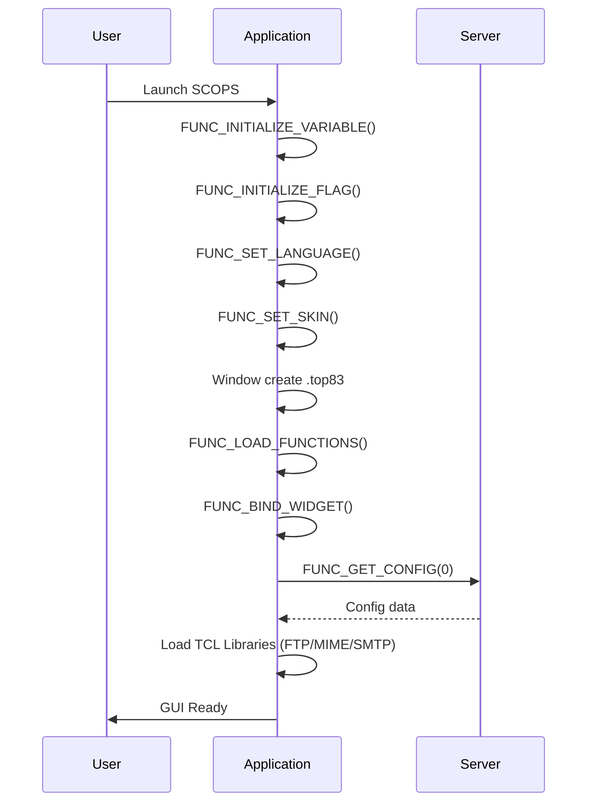
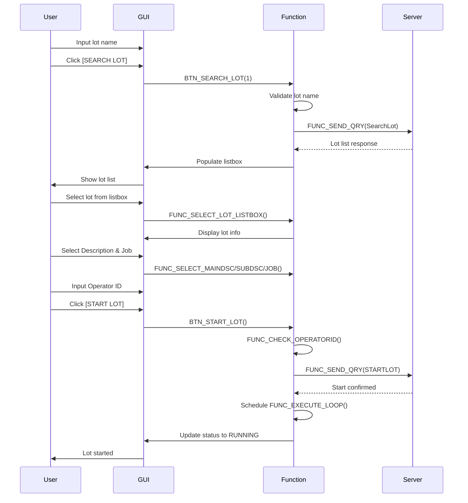

# SCOPS 3 QORVO PGM2 - UI & BUTTON-FUNCTION MAPPING

## Phần 1: GIAO DIỆN CHÍNH (MAIN WINDOW STRUCTURE)

```
╔════════════════════════════════════════════════════════════════════════════════╗
║                    SCOPS 3 QORVO PGM2 - MAIN INTERFACE                         ║
║                                                                                ║
║  ┌─────────────────────────────────────────────────────────────────────────┐  ║
║  │ Notebook Tabs (.top83.not84):                                           │  ║
║  │  ┌────────┬──────────────┬────────────┬────────┬────────┬──────┬────┐  │  ║
║  │  │ Page1  │ Page2        │ Page3      │ Page4  │ Page5  │Page6│Page7   │  ║
║  │  │ LOT    │ JOB/DESC     │ EXECUTE    │ RFID   │ RESULT │ END  │ DEBUG │  ║
║  │  └────────┴──────────────┴────────────┴────────┴────────┴──────┴────┘  │  ║
║  └─────────────────────────────────────────────────────────────────────────┘  ║
│                                                                                │
│  Status Bar: [Host Status] [Lot Status] [Current Operation]                   │
│  Log Window: [Real-time log display]                                          │
└────────────────────────────────────────────────────────────────────────────────┘
```

---

## Phần 2: UI ELEMENTS & BUTTON-FUNCTION MAPPING

### 2.1 PAGE 1: LOT SEARCH & SELECTION (LOT tìm kiếm)

```
┌─────────────────────────────────────────────────────────────────┐
│ PAGE 1: LOT SEARCH & SELECTION                                  │
├─────────────────────────────────────────────────────────────────┤
│                                                                 │
│  Lot Name Input:  [___________________]                         │
│                                                                 │
│  ┌───────────────────────────────────────────────────────────┐ │
│  │ [🔍 SEARCH LOT]      [🗑️  CLEAR]                           │ │
│  └───────────────────────────────────────────────────────────┘ │
│                                                                 │
│  Search Results (Listbox):                                      │
│  ┌───────────────────────────────────────────────────────────┐ │
│  │ • LOT001 [DCC: A101] [OP: MFG]                            │ │
│  │ • LOT002 [DCC: B202] [OP: TEST]                           │ │
│  │ • LOT003 [DCC: C303] [OP: QA]                             │ │
│  └───────────────────────────────────────────────────────────┘ │
│                                                                 │
│  Lot Info Display:                                              │
│  DCC: [________________]  Operation: [________________]         │
│  Job: [________________]                                        │
│                                                                 │
└─────────────────────────────────────────────────────────────────┘
```

**BUTTON-FUNCTION MAPPING:**

| Button | Function Called | Parameters | Return |
|--------|-----------------|-----------|--------|
| 🔍 SEARCH LOT | `BTN_SEARCH_LOT(flag)` | flag=1 | Populate g_lst_lotname |
| 🗑️ CLEAR | `FUNC_CLEAR_LOT()` | None | Reset all lot variables |
| [Listbox Selection] | `FUNC_SELECT_LOT_LISTBOX()` | None | Set g_lotname, g_dcc, g_operation |

---

### 2.2 PAGE 2: JOB & DESCRIPTION SELECTION

```
┌─────────────────────────────────────────────────────────────────┐
│ PAGE 2: JOB & DESCRIPTION SELECTION                             │
├─────────────────────────────────────────────────────────────────┤
│                                                                 │
│  Main Description:                                              │
│  ┌─────────────────────────────────────────────────────────┐  │
│  │ [Select Main Desc ▼]                                    │  │
│  └─────────────────────────────────────────────────────────┘  │
│                                                                 │
│  Sub Description:                                               │
│  ┌─────────────────────────────────────────────────────────┐  │
│  │ [Select Sub Desc ▼]                                     │  │
│  └─────────────────────────────────────────────────────────┘  │
│                                                                 │
│  Job List:                                                      │
│  ┌─────────────────────────────────────────────────────────┐  │
│  │ • JOB001 - Description 1                                │  │
│  │ • JOB002 - Description 2                                │  │
│  │ • JOB003 - Description 3                                │  │
│  └─────────────────────────────────────────────────────────┘  │
│                                                                 │
│  Job Details:                                                   │
│  Program: [________________]  Rev: [________________]           │
│  Condition: [________________]  Time: [________________]        │
│                                                                 │
└─────────────────────────────────────────────────────────────────┘
```

**BUTTON-FUNCTION MAPPING:**

| Widget | Event | Function Called | Action |
|--------|-------|-----------------|--------|
| Main Desc Combo | Selection Changed | `FUNC_SELECT_MAINDSC_COMBOBOX()` | Load sub descriptions |
| Sub Desc Combo | Selection Changed | `FUNC_SELECT_SUBDSC_COMBOBOX()` | Load job list |
| Job Listbox | Double-Click/Select | `FUNC_SELECT_JOB_LISTBOX()` | Set g_job, enable Start button |

---

### 2.3 PAGE 3: TEST EXECUTION (Thực thi Test)

```
┌─────────────────────────────────────────────────────────────────┐
│ PAGE 3: TEST EXECUTION                                          │
├─────────────────────────────────────────────────────────────────┤
│                                                                 │
│  Lot Information:                                               │
│  Lot: [LOT001]  DCC: [A101]  Job: [JOB001]                    │
│                                                                 │
│  Operator ID:                                                   │
│  [___________________]                                          │
│  *Click this field to enable Start button                       │
│                                                                 │
│  ┌─────────────────────────────────────────────────────────┐  │
│  │ [START LOT] [SET DOWN] [PAUSE] [RESUME]                 │  │
│  └─────────────────────────────────────────────────────────┘  │
│                                                                 │
│  Status Information:                                            │
│  Host Status: [READY]  Lot Status: [RUNNING]                  │
│  Elapsed Time: [00:15:32]  Progress: [████████░░] 80%        │
│                                                                 │
│  Test Loop Status:                                              │
│  Last Update: [12:34:56]  Iterations: [1250]                  │
│  Next APL: [T2000 in 5s]                                       │
│                                                                 │
└─────────────────────────────────────────────────────────────────┘
```

**BUTTON-FUNCTION MAPPING:**

| Button | Function Called | Conditions | Action |
|--------|-----------------|-----------|--------|
| Operator ID Field | Auto (Click) | - | Enable START LOT button |
| [START LOT] | `BTN_START_LOT()` | Operator ID filled + Job selected | Start test execution |
| [SET DOWN] | `BTN_SET_DOWN()` | Lot started | Lower probe/socket |
| [Auto Loop] | `FUNC_EXECUTE_LOOP()` | Lot running | Periodic: every 1000ms |
| [Get Host Status] | `FUNC_GET_HOSTSTATUS()` | - | Update host status display |
| [Get Lot Info] | `FUNC_GET_LOTINFORMATION()` | - | Refresh lot information |

---

### 2.4 PAGE 4: RFID & DEVICE MANAGEMENT

```
┌─────────────────────────────────────────────────────────────────┐
│ PAGE 4: RFID & DEVICE MANAGEMENT                                │
├─────────────────────────────────────────────────────────────────┤
│                                                                 │
│  ┌────────────────────────────────────────────────────────┐   │
│  │ [🔍 SEARCH RFID]   [🔄 REFRESH]   [✓ VALIDATE]        │   │
│  └────────────────────────────────────────────────────────┘   │
│                                                                 │
│  RFID Result Display:                                           │
│  ┌────────────────────────────────────────────────────────┐   │
│  │ Tag Found: [RFID_12345ABC]                             │   │
│  │ Lot Name: [LOT001]                                     │   │
│  │ Status: [✓ MATCH]                                      │   │
│  └────────────────────────────────────────────────────────┘   │
│                                                                 │
│  Device Information:                                            │
│  Device Name: [___________________]                            │
│  Device ID: [___________________]                              │
│                                                                 │
│  Touch Down Status:                                             │
│  Probe Touch:  [5/10] [Clear] [+Extend]                       │
│  Socket Touch: [3/20] [Clear] [+Extend]                       │
│                                                                 │
│  ┌────────────────────────────────────────────────────────┐   │
│  │ [Check Probe Touchdown] [Check Socket Touchdown]       │   │
│  └────────────────────────────────────────────────────────┘   │
│                                                                 │
└─────────────────────────────────────────────────────────────────┘
```

**BUTTON-FUNCTION MAPPING:**

| Button | Function Called | Action |
|--------|-----------------|--------|
| 🔍 SEARCH RFID | `BTN_SEARCH_RFID()` | Read RFID tag from device |
| 🔄 REFRESH | `FUNC_RFID_REFRESH()` | Update RFID data |
| ✓ VALIDATE | `FUNC_RFID_COMPARE_LOTS()` | Compare RFID with lot info |
| [Check Probe Touchdown] | `FUNC_RFID_CHECK_PROBETOUCHDOWN(flag)` | Check probe status |
| [Check Socket Touchdown] | `FUNC_RFID_CHECK_SOCKETTOUCHDOWN()` | Check socket status |
| [Clear Probe] | `FUNC_RFID_CLEAR_PROBETOUCHDOWN()` | Reset probe touch count |
| [Clear Socket] | `FUNC_RFID_CLEAR_SOCKETTOUCHDOWN()` | Reset socket touch count |
| [+Extend Probe] | `FUNC_RFID_EXTEND_PROBELIMIT()` | Increase probe limit |
| [+Extend Socket] | `FUNC_RFID_EXTEND_SOCKETLIMIT()` | Increase socket limit |

---

### 2.5 PAGE 5: TEST RESULT INPUT

```
┌─────────────────────────────────────────────────────────────────┐
│ PAGE 5: TEST RESULT INPUT                                       │
├─────────────────────────────────────────────────────────────────┤
│                                                                 │
│  Test Measurement Results:                                      │
│                                                                 │
│  Comment:                                                       │
│  [_____________________________________________________]         │
│                                                                 │
│  TPA Result:                                                    │
│  [_______________]  Unit: [dB]                                 │
│                                                                 │
│  Temperature:                                                   │
│  [_______________]  Unit: [°C]                                 │
│                                                                 │
│  SWR Number:                                                    │
│  [_______________]  Message: [________________]                 │
│                                                                 │
│  T1 / T2:                                                       │
│  T1: [___________]  T2: [___________]                          │
│                                                                 │
│  ┌─────────────────────────────────────────────────────┐      │
│  │ [SUBMIT RESULT]  [DISPLAY SWR]  [CLEAR FORM]       │      │
│  └─────────────────────────────────────────────────────┘      │
│                                                                 │
│  Result Display:                                                │
│  ┌─────────────────────────────────────────────────────┐      │
│  │ [SWR Graph]                                         │      │
│  │ Min: 1.2  Max: 2.5  Avg: 1.8                        │      │
│  └─────────────────────────────────────────────────────┘      │
│                                                                 │
└─────────────────────────────────────────────────────────────────┘
```

**BUTTON-FUNCTION MAPPING:**

| Button | Function Called | Action |
|--------|-----------------|--------|
| [SUBMIT RESULT] | `BTN_INPUT_TESTRESULT()` | Validate & send result to server |
| → Validation | `FUNC_CHECK_COMMENT()` | Validate comment format |
| → Validation | `FUNC_CHECK_TPA()` | Validate TPA value range |
| → Validation | `FUNC_CHECK_T1T2()` | Validate T1/T2 values |
| → Validation | `FUNC_CHECK_SWR()` | Validate SWR format |
| → Validation | `FUNC_CHECK_TPGM()` | Check test program compatibility |
| → Upload | `FUNC_SEND_QRY()` | Send to SCOPS server |
| [DISPLAY SWR] | `FUNC_DISPLAY_SWR()` | Show SWR graph/chart |
| [CLEAR FORM] | Clear all input fields | Reset input entries |

---

### 2.6 PAGE 6: LOT COMPLETION & RETEST

```
┌─────────────────────────────────────────────────────────────────┐
│ PAGE 6: LOT COMPLETION & RETEST                                 │
├─────────────────────────────────────────────────────────────────┤
│                                                                 │
│  Current Lot Status:                                            │
│  Lot: [LOT001]  Status: [RUNNING]  Time: [00:45:23]           │
│  Total Results Submitted: [250]  Retests: [2]                 │
│                                                                 │
│  Downtime Information:                                          │
│  Downtime Start: [12:30:00]  Duration: [___________] min       │
│  Reason: [_____________________________]                        │
│                                                                 │
│  ┌─────────────────────────────────────────────────────┐      │
│  │ [ADD RETEST]           [END LOT]                    │      │
│  └─────────────────────────────────────────────────────┘      │
│                                                                 │
│  Retest History:                                                │
│  ┌─────────────────────────────────────────────────────┐      │
│  │ Retest #1: 12:20:00 - Reason: TPA Out of Range     │      │
│  │ Retest #2: 12:35:00 - Reason: Manual Retest        │      │
│  └─────────────────────────────────────────────────────┘      │
│                                                                 │
│  Completion Summary:                                            │
│  ┌─────────────────────────────────────────────────────┐      │
│  │ [Ready to End - All data prepared]                  │      │
│  └─────────────────────────────────────────────────────┘      │
│                                                                 │
└─────────────────────────────────────────────────────────────────┘
```

**BUTTON-FUNCTION MAPPING:**

| Button | Function Called | Action |
|--------|-----------------|--------|
| [ADD RETEST] | `BTN_ADD_RETEST()` | Add lot to retest queue |
| → Confirm | `FUNC_CONFIRM_VALIDATION()` | Confirm retest addition |
| → Query | `FUNC_SEND_QRY()` | Send retest command to server |
| [END LOT] | `BTN_END_LOT()` | Complete lot and finalize |
| → Confirm | `FUNC_CONFIRM_VALIDATION_LOG()` | Confirm lot ending |
| → Verify | `FUNC_CHECK_FULLTEST()` | Verify full test completed |
| → Verify | `FUNC_CHECK_RETEST()` | Check retest status |
| → Finalize | `FUNC_SET_FLAG_END_LOT()` | Set end flags |
| → Upload | `FUNC_SEND_QRY()` | Send end lot to server |
| → Optional | `FUNC_DEBUG_SENDFILE()` | Send debug log if enabled |
| → Cleanup | `FUNC_CLEAR_LOT()` | Clear all lot data from memory |

---

### 2.7 PAGE 7: APL EXECUTION (Advanced Programming Logic)

```
┌─────────────────────────────────────────────────────────────────┐
│ PAGE 7: APL EXECUTION                                           │
├─────────────────────────────────────────────────────────────────┤
│                                                                 │
│  Available APL Options:                                         │
│                                                                 │
│  ┌─────────────────────────────────────────────────────┐      │
│  │ [APL Windows]      Execute APL on Windows platform  │      │
│  │ [APL T2000]        Execute on T2000 Tester         │      │
│  │ [APL T5585]        Execute on T5585 Tester         │      │
│  │ [APL Xilinx]       Execute on Xilinx Board         │      │
│  │ [APL Microchip]    Execute on Microchip Device     │      │
│  │ [APL EVE_SLT]      Execute on EVE SLT              │      │
│  │ [APL EVE_UFLEX]    Execute on EVE UFLEX            │      │
│  └─────────────────────────────────────────────────────┘      │
│                                                                 │
│  APL Execution History:                                         │
│  ┌─────────────────────────────────────────────────────┐      │
│  │ 12:15:23 - APL Windows - Status: COMPLETED ✓       │      │
│  │ 12:20:10 - APL T2000 - Status: COMPLETED ✓         │      │
│  │ 12:30:45 - APL Xilinx - Status: RUNNING...         │      │
│  └─────────────────────────────────────────────────────┘      │
│                                                                 │
│  Current APL Status: [T2000 Executing Command...]              │
│  Next Scheduled: [APL Windows in 15 seconds]                   │
│                                                                 │
└─────────────────────────────────────────────────────────────────┘
```

**BUTTON-FUNCTION MAPPING:**

| Button | Function Called | Action |
|--------|-----------------|--------|
| [APL Windows] | `FUNC_APL_WINDOWS(flag)` | Execute Windows APL program |
| [APL T2000] | `FUNC_APL_T2000(flag)` | Execute T2000 Tester APL |
| [APL T5585] | `FUNC_APL_T5585()` | Execute T5585 Tester APL |
| [APL Xilinx] | `FUNC_APL_XILINX()` | Execute Xilinx APL |
| [APL Microchip] | `FUNC_APL_MICROCHIP(flag)` | Execute Microchip APL |
| [APL EVE_SLT] | `FUNC_APL_EVE_SLT(flag)` | Execute EVE SLT APL |
| [APL EVE_UFLEX] | `FUNC_APL_EVE_UFLEX(flag)` | Execute EVE UFLEX APL |
| (Auto-dispatch) | `FUNC_EXECUTE_APL()` | Main dispatcher based on config |
| (Command execution) | `FUNC_EXECUTE_XTERM(cmd)` | Execute command in xterm |

---

### 2.8 PAGE 8: DEBUG & DIAGNOSTICS

```
┌─────────────────────────────────────────────────────────────────┐
│ PAGE 8: DEBUG & DIAGNOSTICS                                     │
├─────────────────────────────────────────────────────────────────┤
│                                                                 │
│  Debug Options:                                                 │
│                                                                 │
│  ┌─────────────────────────────────────────────────────┐      │
│  │ [CLEAR LOG]        Clear all debug messages         │      │
│  │ [SAVE LOG]         Save debug log to file           │      │
│  │ [DELETE LOG FILE]  Delete saved log file            │      │
│  │ [SEND LOG FILE]    Send log via email               │      │
│  └─────────────────────────────────────────────────────┘      │
│                                                                 │
│  Debug Listbox:                                                 │
│  ┌─────────────────────────────────────────────────────┐      │
│  │ 12:15:23.123 [INFO] FUNC_EXECUTE_LOOP called       │      │
│  │ 12:15:24.456 [DEBUG] RFID_REFRESH: Tag = 12345     │      │
│  │ 12:15:25.789 [WARN] TPA value low: 0.5 dB          │      │
│  │ 12:15:26.012 [ERROR] Socket timeout on device      │      │
│  │ 12:15:27.345 [INFO] Retest added for LOT001        │      │
│  │ 12:15:28.678 [DEBUG] Sending query to server...    │      │
│  │ 12:15:29.901 [INFO] Response received: ACCEPTED    │      │
│  │ 12:15:30.234 [DEBUG] Next loop scheduled           │      │
│  └─────────────────────────────────────────────────────┘      │
│                                                                 │
│  Configuration & Status:                                        │
│  Debug Mode: [✓ Enabled]  Log File: [/logs/scops_debug.log]   │
│  SCOPS Version: [8_3_QORVO_PGM2]                               │
│  Server: [10.201.16.50:8080]                                   │
│                                                                 │
└─────────────────────────────────────────────────────────────────┘
```

**BUTTON-FUNCTION MAPPING:**

| Button | Function Called | Action |
|--------|-----------------|--------|
| [CLEAR LOG] | `FUNC_DEBUG_CLEAR()` | Clear debug log from display |
| [SAVE LOG] | `FUNC_DEBUG_SAVE()` | Save current log to file |
| [DELETE LOG FILE] | `FUNC_DEBUG_DELETEFILE()` | Delete saved log file from disk |
| [SEND LOG FILE] | `FUNC_DEBUG_SENDFILE()` | Send log file via email |
| → Email handler | `FUNC_SEND_EMAIL()` | Actual email sending |
| (Auto logging) | `FUNC_DEBUG(str)` | Log message to debug window |
| (Message display) | `FUNC_DISPLAY_MESSAGE()` | Show message box |

---

## Phần 3: SECONDARY WINDOWS

### 3.1 CONFIRMATION WINDOW (.top86)

```
┌─────────────────────────────────────────────────────┐
│                   CONFIRMATION DIALOG                │
├─────────────────────────────────────────────────────┤
│                                                     │
│  ⚠️  [Confirmation Message Title]                   │
│                                                     │
│  [Detailed message text will appear here.          │
│   It explains what action will be performed.]       │
│                                                     │
│  ┌────────────────────────────────────────────┐   │
│  │ [OK]                  [CANCEL]               │   │
│  └────────────────────────────────────────────┘   │
│                                                     │
│  [X] Close Window                                   │
│                                                     │
└─────────────────────────────────────────────────────┘
```

**WINDOW-FUNCTION MAPPING:**

| Element | Function Called | Action |
|---------|-----------------|--------|
| [OK] | (Callback function) | Proceed with action |
| [CANCEL] | (Callback function) | Cancel action |
| [X] Close | `FUNC_CLOSE_CONFIRMATION()` | Close confirmation window |

---

### 3.2 RFID READER WINDOW (.top85)

```
┌─────────────────────────────────────────────────────┐
│               RFID READER WINDOW                     │
├─────────────────────────────────────────────────────┤
│                                                     │
│  RFID TAG DETECTED:                                │
│                                                     │
│  Tag ID: [═════════════════════════════════]       │
│  Lot Name: [════════════════════════════]          │
│  Device ID: [════════════════════════════]         │
│  Status: [✓ VALID] [Time: 12:34:56.789]            │
│                                                     │
│  ┌───────────────────────────────────────┐        │
│  │ [REFRESH]      [VALIDATE]      [CLOSE]│        │
│  └───────────────────────────────────────┘        │
│                                                     │
│  [X] Close Window                                   │
│                                                     │
└─────────────────────────────────────────────────────┘
```

**WINDOW-FUNCTION MAPPING:**

| Element | Function Called | Action |
|---------|-----------------|--------|
| [REFRESH] | `FUNC_RFID_REFRESH()` | Update RFID data |
| [VALIDATE] | `FUNC_RFID_COMPARE_LOTS()` | Validate RFID vs Lot |
| [CLOSE] | `FUNC_CLOSE_RFID()` | Close RFID window |
| [X] Close | `FUNC_CLOSE_RFID()` | Same as [CLOSE] |

---

## Phần 4: EVENT HANDLERS & CALLBACKS

### 4.1 WIDGET CLICK/SELECTION EVENTS

```
USER INTERACTION FLOW:
                                    ↓
         ┌──────────────────────────────────────┐
         │ User clicks on Widget/Button          │
         └──────────────────────────────────────┘
                        │
                        ↓
         ┌──────────────────────────────────────┐
         │ Event triggered (<Button-1>, etc)    │
         └──────────────────────────────────────┘
                        │
                        ↓
         ┌──────────────────────────────────────┐
         │ FUNC_BIND_WIDGET() setup called      │
         │ (at application startup)              │
         └──────────────────────────────────────┘
                        │
                        ↓
         ┌──────────────────────────────────────┐
         │ Corresponding Handler Function        │
         │ (BTN_*, FUNC_*, etc)                 │
         └──────────────────────────────────────┘
                        │
                        ↓
         ┌──────────────────────────────────────┐
         │ Execute function body                │
         │ (validate, query, update UI)          │
         └──────────────────────────────────────┘
```

### 4.2 CALLBACK CHAINS

**Example 1: Search Lot Chain**
```
User Input (Lot Name)
    ↓
[SEARCH LOT] Button Click
    ↓
BTN_SEARCH_LOT(flag)
    ├─ Validate g_ent_lotname not empty
    ├─ Call FUNC_SEND_QRY("SCOPS,SearchLot,...")
    │   └─ FUNC_CREATE_SOCKET() → send query → get response
    └─ Parse response → populate g_lst_lotname
        ↓
User Click [Listbox Item]
    ↓
FUNC_SELECT_LOT_LISTBOX()
    └─ Extract lot info → display
```

**Example 2: Start Lot Chain**
```
User Input + [START LOT] Click
    ↓
BTN_START_LOT()
    ├─ FUNC_CHECK_OPERATORID()
    ├─ FUNC_CHECK_VARIABLE(...)
    ├─ FUNC_GET_LOTINFORMATION()
    ├─ FUNC_GET_CONFIG(0)
    ├─ FUNC_SEND_QRY("SCOPS,SETLOTSTATUS,...")
    └─ Schedule: FUNC_EXECUTE_LOOP() every 1000ms
        ↓
Loop Runs Every 1000ms:
    ├─ FUNC_EXECUTE_LOOP()
    │   ├─ FUNC_GET_HOSTSTATUS()
    │   ├─ FUNC_EXECUTE_APL() [if enabled]
    │   ├─ FUNC_RFID_REFRESH()
    │   └─ Schedule next loop
```

---

## Phần 5: KEYBOARD BINDING SETUP

**File: scops3_8_3_QORVO_PGM2.tcl - Lines 16411-16450**

```tcl
proc ::FUNC_BIND_WIDGET {} {
    global widget

    # ↓ Click on Operator ID field → Enable Start button
    global g_ent_operatorid
    bind $g_ent_operatorid <Button-1> {
        global g_btn_start
        $g_btn_start configure -state normal
    }

    # ↓ Close confirmation window → Hide .top86
    proc FUNC_CLOSE_CONFIRMATION {} {
        Window hide .top86
    }
    wm protocol .top86 WM_DELETE_WINDOW FUNC_CLOSE_CONFIRMATION

    # ↓ Close RFID window → Hide .top85
    proc FUNC_CLOSE_RFID {} {
        Window hide .top85
    }
    wm protocol .top85 WM_DELETE_WINDOW FUNC_CLOSE_RFID

    # ↓ Close SCOPS → Exit application
    proc FUNC_CLOSE_SCOPS {} {
        exit
    }
    wm protocol .top83 WM_DELETE_WINDOW FUNC_CLOSE_SCOPS
}
```

**BINDING MAPPINGS:**

| Event | Widget | Action | Function |
|-------|--------|--------|----------|
| Click (Button-1) | g_ent_operatorid | Enable start button | Auto |
| WM_DELETE_WINDOW | .top86 | Close confirmation | FUNC_CLOSE_CONFIRMATION |
| WM_DELETE_WINDOW | .top85 | Close RFID window | FUNC_CLOSE_RFID |
| WM_DELETE_WINDOW | .top83 | Close main window | FUNC_CLOSE_SCOPS |

---

## Phần 6: COMPLETE BUTTON-FUNCTION REFERENCE TABLE

| Tab | Button Name | Variable/Widget | Function Called | Dependencies |
|-----|-------------|-----------------|-----------------|--------------|
| LOT | Search Lot | (Button) | `BTN_SEARCH_LOT(1)` | FUNC_SEND_QRY |
| LOT | Clear | (Button) | `FUNC_CLEAR_LOT()` | - |
| LOT | Listbox Select | g_lst_lotname | `FUNC_SELECT_LOT_LISTBOX()` | - |
| JOB | Main Desc Combo | g_cbo_maindsc | `FUNC_SELECT_MAINDSC_COMBOBOX()` | FUNC_SEND_QRY |
| JOB | Sub Desc Combo | g_cbo_subdsc | `FUNC_SELECT_SUBDSC_COMBOBOX()` | FUNC_SEND_QRY |
| JOB | Job Listbox | g_lst_job | `FUNC_SELECT_JOB_LISTBOX()` | - |
| EXEC | Operator ID Field | g_ent_operatorid | (Bind: Enable button) | - |
| EXEC | Start Lot | g_btn_start | `BTN_START_LOT()` | BTN_SEARCH_LOT + FUNC_SELECT_JOB |
| EXEC | Set Down | (Button) | `BTN_SET_DOWN()` | BTN_START_LOT |
| EXEC | Loop | (Timer) | `FUNC_EXECUTE_LOOP()` | BTN_START_LOT |
| RFID | Search RFID | (Button) | `BTN_SEARCH_RFID()` | BTN_START_LOT |
| RFID | Refresh | (Auto) | `FUNC_RFID_REFRESH()` | FUNC_EXECUTE_LOOP |
| RFID | Validate | (Button) | `FUNC_RFID_COMPARE_LOTS()` | BTN_SEARCH_RFID |
| RFID | Check Probe | (Button) | `FUNC_RFID_CHECK_PROBETOUCHDOWN()` | FUNC_EXECUTE_LOOP |
| RFID | Check Socket | (Button) | `FUNC_RFID_CHECK_SOCKETTOUCHDOWN()` | FUNC_EXECUTE_LOOP |
| RFID | Clear Probe | (Button) | `FUNC_RFID_CLEAR_PROBETOUCHDOWN()` | - |
| RFID | Clear Socket | (Button) | `FUNC_RFID_CLEAR_SOCKETTOUCHDOWN()` | - |
| RFID | Extend Probe | (Button) | `FUNC_RFID_EXTEND_PROBELIMIT()` | - |
| RFID | Extend Socket | (Button) | `FUNC_RFID_EXTEND_SOCKETLIMIT()` | - |
| RESULT | Submit Result | g_btn_input | `BTN_INPUT_TESTRESULT()` | FUNC_CHECK_* |
| RESULT | Display SWR | (Button) | `FUNC_DISPLAY_SWR()` | BTN_INPUT_TESTRESULT |
| END | Add Retest | g_btn_addretest | `BTN_ADD_RETEST()` | BTN_START_LOT |
| END | End Lot | g_btn_endlot | `BTN_END_LOT()` | BTN_START_LOT |
| APL | APL Windows | (Button) | `FUNC_APL_WINDOWS(flag)` | FUNC_EXECUTE_LOOP |
| APL | APL T2000 | (Button) | `FUNC_APL_T2000(flag)` | FUNC_EXECUTE_LOOP |
| APL | APL T5585 | (Button) | `FUNC_APL_T5585()` | FUNC_EXECUTE_LOOP |
| APL | APL Xilinx | (Button) | `FUNC_APL_XILINX()` | FUNC_EXECUTE_LOOP |
| APL | APL Microchip | (Button) | `FUNC_APL_MICROCHIP(flag)` | FUNC_EXECUTE_LOOP |
| APL | APL EVE_SLT | (Button) | `FUNC_APL_EVE_SLT(flag)` | FUNC_EXECUTE_LOOP |
| APL | APL EVE_UFLEX | (Button) | `FUNC_APL_EVE_UFLEX(flag)` | FUNC_EXECUTE_LOOP |
| DEBUG | Clear Log | (Button) | `FUNC_DEBUG_CLEAR()` | - |
| DEBUG | Save Log | (Button) | `FUNC_DEBUG_SAVE()` | - |
| DEBUG | Delete Log | (Button) | `FUNC_DEBUG_DELETEFILE()` | FUNC_DEBUG_SAVE |
| DEBUG | Send Log | (Button) | `FUNC_DEBUG_SENDFILE()` | FUNC_DEBUG_SAVE |

---

## Phần 7: EXECUTION SEQUENCE DIAGRAMS

### 7.1 MAIN APPLICATION STARTUP SEQUENCE



### 7.2 LOT SEARCH AND START SEQUENCE



---

## Phần 8: NOTES & TIPS

### 8.1 Important Relationships
- **Buttons are dependent on state**: Most buttons only work after previous steps complete
- **Automatic loops**: Once lot starts, FUNC_EXECUTE_LOOP() runs every 1000ms automatically
- **Cascading validations**: Each input step validates data before moving to next step
- **Query-driven UI**: All data comes from SCOPS server via FUNC_SEND_QRY()

### 8.2 Widget State Changes
```
Application Startup:
  [Search Lot] = Enabled
  [Start Lot] = Disabled (requires Operator ID)
  [Set Down] = Disabled (requires lot started)
  [Add Retest] = Disabled (requires lot started)
  [End Lot] = Disabled (requires lot started)

After Lot Search & Job Selection:
  [Start Lot] = Enabled (if Operator ID filled)

After [START LOT] clicked:
  [Search Lot] = Disabled
  [Set Down] = Enabled
  [Add Retest] = Enabled
  [End Lot] = Enabled
  [APL Buttons] = Enabled
  [Input Result] = Enabled

After [END LOT] clicked:
  Reset to initial state for next lot
```

### 8.3 Function Call Stack Example
```
BTN_INPUT_TESTRESULT()
    ├─ FUNC_CHECK_COMMENT()          [Validation 1]
    ├─ FUNC_CHECK_TPA()              [Validation 2]
    ├─ FUNC_CHECK_T1T2()             [Validation 3]
    ├─ FUNC_CHECK_SWR()              [Validation 4]
    ├─ FUNC_CHECK_TPGM()             [Validation 5]
    ├─ FUNC_CHECK_DATASTREAM()       [Validation 6]
    ├─ FUNC_CHECK_DRL()              [Validation 7]
    ├─ FUNC_SEND_QRY()               [Network]
    ├─ FUNC_DISPLAY_SWR()            [Display]
    └─ FUNC_DISPLAY_MESSAGE()        [Notification]
```

---

## END OF UI MAPPING DOCUMENT

**Version:** 1.0  
**Date:** May 21, 2026  
**For:** SCOPS 3.8.3 QORVO PGM2

This document provides a complete visual guide to:
✓ GUI layout and structure  
✓ Button-function mapping  
✓ Event flow and callbacks  
✓ Widget interactions  
✓ Execution sequences  
✓ State management  

**See Also:** DOCUMENTATION_QORVO_PGM2.md for detailed function descriptions
