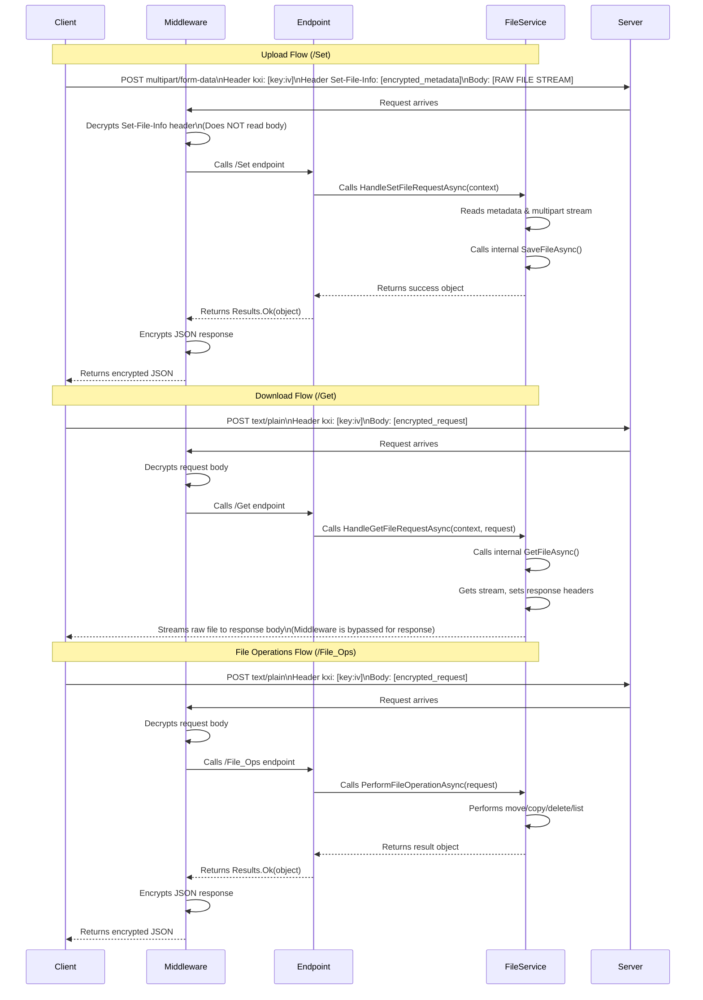

### 8. File Service API

This set of endpoints provides secure, streaming-first file upload, download, and management operations. The `EncryptionCompressionMiddleware` plays a key role in handling the security for these endpoints.

#### 8.1. File Service Workflow Diagram



#### 8.2. `POST /Common/File_Method/Set` (File Upload)

Securely uploads a file to the server using a streaming approach to handle large files efficiently.

*   **Request Type**: `multipart/form-data`
*   **Headers**:
    *   `kxi`: The Base85 encoded key & IV used to encrypt the metadata header.
    *   `Set-File-Info`: The encrypted, Base85 encoded metadata JSON.
*   **Body**: The raw binary data of the file, sent as a single part named `file`.
*   **Metadata Structure (before encryption)**:
    ```json
    {
      "AppName": "YourAppName",
      "Destination": "\\server\share\uploads",
      "SaveMode": "Rename",
      "FileName": "example.jpg",
      "FileSize": 123456
    }
    ```
    *   `AppName` (string): Used by the server to map to a pre-configured storage directory.
    *   `Destination` (string, optional): An explicit destination path. If provided, it may override the `AppName` mapping.
    *   `SaveMode` (string): `Rename` (default) saves the file with a unique timestamped name in a `YYYY/MM/DD` subfolder. `KeepName` saves the file with its original name directly in the destination.
    *   `FileName` (string): The original name of the file.
    *   `FileSize` (long): The size of the file in bytes. This is validated against the actual size of the file received by the server.
    *   **Success Response (decrypted)**:
        ```json
        {
          "code": 200,
          "message": "OK",
          "body": {
            "fullFilePath": "D:\\Storage\\AppName\\2023\\10\\27\\20231027T123000_GUID_example.jpg",
            "relativePath": "2023\\10\\27\\20231027T123000_GUID_example.jpg"
          }
        }
        ```
#### 8.3. `POST /Common/File_Method/Get` (File Download)

Securely requests a file for download. The response is a raw, unencrypted file stream that browsers can process directly.

*   **Request Type**: `text/plain`
*   **Headers**:
    *   `kxi`: The Base85 encoded key & IV used to encrypt the request body.
*   **Request Body (before encryption)**:
    ```json
    {
      "filePath": "\\server\share\path\to\your\file.pdf",
      "fileName": "your_filename.pdf",
    }
    ```
*   **Response**:
    *   The raw binary stream of the requested file.
    *   The `Content-Type` header will be set based on the file's extension (e.g., `application/pdf`), allowing browsers to open it.
    *   The `Content-Disposition` header will be set to suggest the original filename.

#### 8.4. `POST /Common/File_Method/File_Ops` (File Operations)

Performs various file system operations like `list`, `move`, `copy`, `delete`, `rename`, and `createdirectory`. This endpoint uses the standard request/response encryption flow.

*   **Request Type**: `text/plain`
*   **Headers**:
    *   `kxi`: The Base85 encoded key & IV used to encrypt the request body.
*   **Request Body Structure (before encryption)**:
    The body is a JSON object containing a `command` string and a nested `operation` object with parameters specific to that command.
    ```json
    {
      "command": "<command_name>",
      "operation": {
        "sourcePath": "\\server\share\path",
        ...
      }
    }
    ```

##### Commands

###### 1. `list`
Lists the contents of a directory.

*   **Request Body Example:**
    ```json
    {
      "command": "list",
      "operation": {
        "sourcePath": "\\server\share\some_folder",
        "filePattern": "*.txt",
        "pageNumber": 1,
        "pageSize": 50,
        "orderBy": "lastModified",
        "ascending": false,
        "paginate": true
      }
    }
    ```
*   **Operation Parameters:**
    *   `sourcePath` (string, required): The directory to list.
    *   `filePattern` (string, optional): A filter pattern (e.g., `*.txt`, `data_*.*`). Defaults to `*` (all files and directories).
    *   `pageNumber` (int, optional): For pagination, the page number to retrieve. Defaults to `1`.
    *   `pageSize` (int, optional): For pagination, the number of items per page. Defaults to `10`.
    *   `orderBy` (string, optional): The field to sort by. Valid options: `name`, `type`, `lastModified`, `size`. Defaults to `name`.
    *   `ascending` (bool, optional): Sort order. `true` for ascending, `false` for descending. Defaults to `true`.
    *   `paginate` (bool, optional): Whether to apply pagination. Defaults to `true`.
*   **Success Response (decrypted):**
    ```json
    {
      "code": 200,
      "message": "OK",
      "body": {
        "items": [
          {
            "name": "file1.txt",
            "size": 1234,
            "type": "File",
            "lastModified": "2023-10-27T10:00:00Z"
          },
          {
            "name": "SubFolder",
            "size": null,
            "type": "Directory",
            "lastModified": "2023-10-26T09:00:00Z"
          }
        ],
        "totalCount": 2
      }
    }
    ```

###### 2. `move`
Moves a file or directory to a new location.

*   **Request Body Example:**
    ```json
    {
      "command": "move",
      "operation": {
        "sourcePath": "\\server\share\old_folder\file.txt",
        "destinationPath": "\\server\share\new_folder\file.txt"
      }
    }
    ```
*   **Operation Parameters:**
    *   `sourcePath` (string, required): The path of the file or directory to move.
    *   `destinationPath` (string, required): The full destination path.

###### 3. `copy`
Copies a file or an entire directory.

*   **Request Body Example:**
    ```json
    {
      "command": "copy",
      "operation": {
        "sourcePath": "\\server\share\templates\report.docx",
        "destinationPath": "\\server\share\reports\new_report.docx"
      }
    }
    ```
*   **Operation Parameters:**
    *   `sourcePath` (string, required): The path of the file or directory to copy.
    *   `destinationPath` (string, required): The full destination path.

###### 4. `delete`
Deletes a file or directory.

*   **Request Body Example:**
    ```json
    {
      "command": "delete",
      "operation": {
        "sourcePath": "\\server\share\temp_files\old_file.tmp",
        "recursive": true
      }
    }
    ```
*   **Operation Parameters:**
    *   `sourcePath` (string, required): The path of the file or directory to delete.
    *   `recursive` (bool, optional): Must be `true` to delete a directory that is not empty. Defaults to `false`.

###### 5. `rename`
Renames a file or directory.

*   **Request Body Example:**
    ```json
    {
      "command": "rename",
      "operation": {
        "sourcePath": "\\server\share\docs\draft.txt",
        "newName": "final_version.txt"
      }
    }
    ```
*   **Operation Parameters:**
    *   `sourcePath` (string, required): The path of the file or directory to rename.
    *   `newName` (string, required): The new name for the file or directory (not the full path).

###### 6. `createdirectory`
Creates a new directory.

*   **Request Body Example:**
    ```json
    {
      "command": "createdirectory",
      "operation": {
        "sourcePath": "\\server\share\new_project_folder"
      }
    }
    ```
*   **Operation Parameters:**
    *   `sourcePath` (string, required): The full path of the new directory to create.

*   **Success Response for `move`, `copy`, `delete`, `rename`, `createdirectory` (decrypted):**
    ```json
    {
      "code": 200,
      "message": "OK",
      "body": {
        "success": true,
        "message": "Operation completed successfully."
      }
    }
    ```
