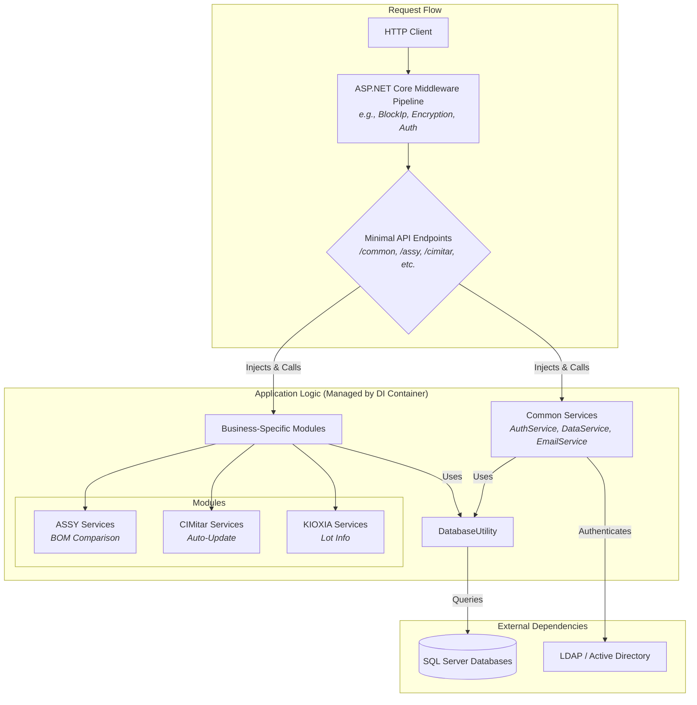
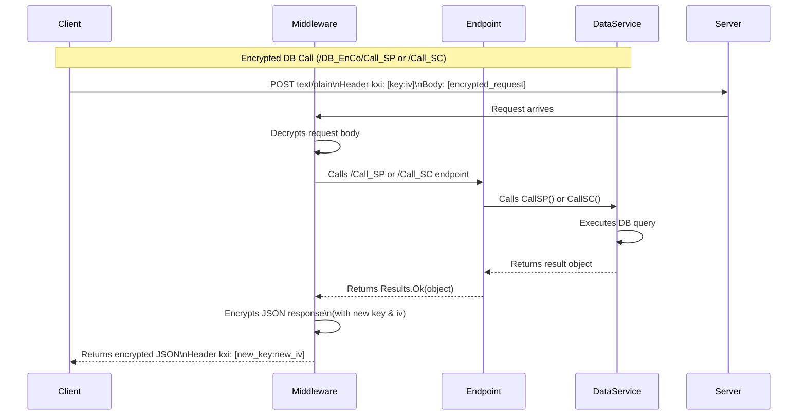
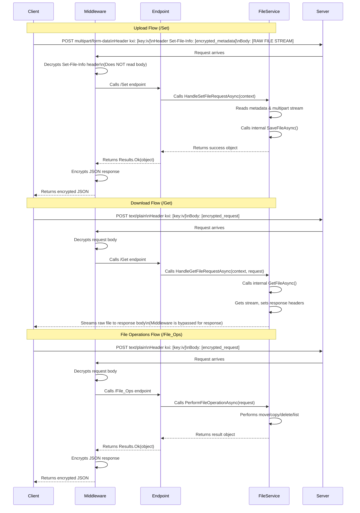

# ATV Common Web API

This project provides a common Web API for various ATV applications, offering functionalities such as database interaction, email services, authentication, and more.

## Conceptual Architecture Overview

This section provides a high-level overview of the application's architecture. The diagram below illustrates the flow of a typical request and the interaction between the key components.



**Explanation:**

This architecture is designed to be modular and scalable, centered around ASP.NET Core's dependency injection (DI) and middleware pipeline.

*   **Request Flow**: An incoming HTTP request from a client first travels through the **Middleware Pipeline**. This is where cross-cutting concerns like IP blocking, request/response encryption, and authentication are handled before the request reaches its destination.

*   **Endpoints**: The request is then routed to a specific **Minimal API Endpoint**. These endpoints are responsible for handling the request, validating input, and orchestrating the business logic by calling one or more services.

*   **Application Logic & DI**: The endpoints do not contain business logic themselves. Instead, the **DI Container** injects instances of services (defined by interfaces) into the endpoints at runtime. This decouples the components and makes the application easy to test and maintain.

*   **Services**: The application's logic is organized into two main categories:
    *   **Common Services**: Core, reusable components for functionalities like authentication (`AuthService`), database interaction (`DataService`), and email (`EmailService`).
    *   **Business-Specific Modules**: These are distinct functional units that serve a specific business purpose. In your project, these are `ASSY`, `CIMitar_Auto_Update`, and `KIOXIA`. The `TEST` folder currently functions as a container for some of these modules.

*   **External Dependencies**: Services interact with external systems. The `DatabaseUtility` abstracts away direct database calls, primarily to **SQL Server**. The `AuthService` communicates with **LDAP/Active Directory** for enterprise logins.

## Overall Project Tree

```
ATV_Common_WebAPI
├── Properties/
├── ASSY/
│   └── Mounter/
│       └── BOM_List_Checking/
│           ├── Interfaces/         : For BOM comparison interfaces (IBOMComparisonService)
│           ├── Models/             : For BOM comparison models (BOMPlacementFileUploadModel, BOMListCheckingModel)
│           └── Services/           : For BOM comparison service implementation (Placement_Compare)
├── ATV_CIMitar_Latest_Version/              : Store CIMitar Application (7z file) for providing to client update/install
│    └── ...                                 : Mermaid document for showing digram of application
├── Common/
│   ├── Interfaces/                 : For all common interfaces (IDataService, IEmailService, ILoggerService, IExcelService, IAuthService)
│   ├── Models/                     : For common data models (AppSettings_Model, Login_Method's models like LoginRequest, User, JwtSettings, RefreshTokenRequest, RefreshTokenResponse)
│   ├── Services/                   : For service implementations (Data_Method, Email_Method, Login_Method.AuthService, Excel_Method, Hash_Method.PasswordHasherBCrypt)
│   ├── Utilities/                  : For general utility classes (DataConverter, DateTimeConverter, Database_Utility, Directory_Method, Other_Method)
│   └── Middleware/                 : For middleware classes (BlockIpMiddleware)
├── Endpoints/                      : Already grouped API endpoint definitions
├── TEST/
│   ├── CIMitar_Auto_Update/
│   │   ├── Interfaces/             : For CIMitar auto-update interfaces (ICIMitarAutoUpdateService)
│   │   ├── Models/                 : For CIMitar auto-update models (CIMitarUploadModel, CIMitarFileModel)
│   │   └── Services/               : For CIMitar auto-update service implementation (CIMitarAutoUpdate)
│   └── KIOXIA/
│       ├── Interfaces/             : For KIOXIA interfaces (IKioxiaService)
│       └── Services/               : For KIOXIA service implementation (Get_Lot_Info)
├── .gitignore
├── appsettings.json                         : Application config file
├── Program.cs                               : Initial app (API route, loading config, db connection initial,...)
└── README.md
```

## API Usage

### 1. Login 

```json
{
  "ldapName": "string",
  "userId": "string",
  "password": "string",
  "appInfo": "string"
}
```

*   **Require field**:
    *   **ldapName:** "ATV" | "ATK" | "LOCAL"
    *   **userId:** AD Account | Local Account
        *   Specially with Local Account
            *   User have no AD Account need to create account manual by SP
            *   User who have AD Account and have a succesful login in the before, can use ldapName = LOCAL for the next login
    *   **password:** Password for account
*   **Optional field:** 
    *   **appInfo:** App info name for control JWT, Refresh Token 
        *   if do not provide appInfo - Login without JWT
        *   if provide appInfo - Login with JWT and Refresh Token

### 2. Email sending

*   Have 2 endpoints for sending email Common/Send_Email and Common/Email_EnCo/Send_Email, with EnCo need Encrypt request body same like DB_EnCo and File_Method, so please refer section 7 and 8 for more detail.

```json
{
  "mailPriority": "string",
  "sender": "string",
  "subject": "string",
  "body": "string",
  "toMailList": ["string"],
  "ccMailList": ["string"],
  "bccMailList": ["string"],
  "attachmentList": [
    {
      "base64File": "string",
      "fileName": "string",
      "mimeType": "string"
    }
  ],
  "smtpConfig": {
    "smtpDomain": "string",
    "smtpAccountName": "string",
    "smtpPassword": "string",
    "smtpPort": 0
  }
}
```

*   **Require field**:
    *   **mailPriority:** "LOW" | "NORMAL" | "HIGH"
    *   **sender:** string
    *   **subject:** string
    *   **body:** string (HTML format)
    *   **toMailList, ccMailList, bccMailList:** list[string] | empty list []
    *   **attachmentList:** list[base64 file info as below] | empty list []
        *   **base64File:** string - require
        *   **fileName:** string - require
        *   **mimeType:** string - require
*   **Optional field:** if have no smtpConfig - server will use ATV_DB_Dev@amkor.com to send email
    *   **smtpConfig**
        *   **smtpDomain:** string - optional
        *   **smtpAccountName:** string - optional (Default is ATV_DB_Dev)
            *   if provided account name in beside list string only ["ATV_Web_Prod_1", "ATV_Web_Prod_2", "ATV_Web_Dev", "ATV_DB_Dev", "ATV_DB_Prod", "atvtfa_notice"] 
                no need provide password for these account
            *   "ATV_Web_Dev", "ATV_DB_Dev", "atvtfa_notice": Can using for all application
            *   "ATV_Web_Prod_1", "ATV_Web_Prod_2", "ATV_DB_Prod": Recommend using for TEST factory application/system/... Because these account created base on CIMitar Server
        *   **smtpPassword:** string - optional (Need to provide when smtpAccountName is not exist in account list above)
        *   **smtpPort:** int - optional (Default is 587)

### 3. CIMitar Auto Update API

#### 3.1. Get Latest Version Info

*   **Endpoint:** `GET /ATV_CIMitar_Launcher/check_version`
*   **Description:** Retrieves the latest version information of the CIMitar application.
*   **Parameters:** None
*   **Response:** Returns a string representing the latest version.

#### 3.2. Get Latest Changelog

*   **Endpoint:** `GET /ATV_CIMitar_Launcher/check_changelog`
*   **Description:** Retrieves the changelog for the latest version of the CIMitar application.
*   **Parameters:** None
*   **Response:** Returns a string containing the changelog.

#### 3.3. Get Latest CIMitar File

*   **Endpoint:** `GET /ATV_CIMitar_Launcher/get_latest_atv_cimitar`
*   **Description:** Downloads the latest CIMitar application file (7z format).
*   **Parameters:** None
*   **Response:** Returns the CIMitar application file as a `application/octet-stream`.

#### 3.4. Upload Latest CIMitar File

*   **Endpoint:** `POST /ATV_CIMitar_Launcher/upload_latest_atv_cimitar`
*   **Description:** Uploads a new version of the CIMitar application file and updates the version and changelog.
*   **Parameters:**

```json
{
  "changelog": "string",
  "file": {
    "fileName": "string",
    "data": "string" 
  }
}
```

    *   **changelog:** (Required) A string describing the changes in this new version.
    *   **file:** (Required) An object containing the file details:
        *   **fileName:** (Required) The name of the file (must end with `.7z`).
        *   **data:** (Required) The file content as a Base64 encoded string.

*   **Response:** Returns a success message if the upload and update are successful, or an error message if the file is invalid or an error occurs.

### 4. ASSY Mounter BOM List Checking API

#### 4.1. Compare BOM And Placement List

*   **Endpoint:** `POST /ASSY/Mounter/BOM_List_Checking/Compare_BOM_And_Placement_List`
*   **Description:** Compares a BOM list and a placement list to find differences.
*   **Parameters:** (Request Body)

```json
{
  "ignoreComparePcb": true,
  "fileList": [
    {
      "fileName": "string",
      "fileType": "BOM" | "Placement",
      "fileFormat": "xlsx" | "xml",
      "fileContentBase64": "string"
    }
  ]
}
```

    *   **ignoreComparePcb:** (Required) A boolean indicating whether to ignore PCB comparison.
    *   **fileList:** (Required) An array containing two file objects (one BOM, one Placement):
        *   **fileName:** (Required) The name of the file.
        *   **fileType:** (Required) The type of the file ("BOM" or "Placement").
        *   **fileFormat:** (Required) The format of the file ("xlsx" for BOM, "xml" for Placement).
        *   **fileContentBase64:** (Required) The file content as a Base64 encoded string.

*   **Response:** Returns a JSON object containing the comparison results, including differences and original data.

#### 4.2. Get Compare BOM Placement Permission

*   **Endpoint:** `GET /ASSY/Mounter/BOM_List_Checking/Get_Compare_BOM_Placement_Permission`
*   **Description:** Retrieves user permissions for BOM and Placement list comparison.
*   **Parameters:**
    *   `badgeNo`: (Query Parameter) The badge number of the user.
*   **Response:** Returns a JSON object with user information and configurations if permission is granted, otherwise returns a 404 Not Found.

#### 4.3. Set BOM List Checking Result

*   **Endpoint:** `POST /ASSY/Mounter/BOM_List_Checking/Set_BOM_List_Checking_Result`
*   **Description:** Saves the result of a BOM list checking operation.
*   **Parameters:** (Request Body)

```json
{
  "lot": "string",
  "dcc": "string",
  "bomFilename": "string",
  "placementFilename": "string",
  "bomContent": "string",
  "placementContent": "string",
  "comparisonResult": true,
  "ignorePcbCompare": true,
  "differentItems": "string",
  "badgeNo": "string"
}
```

    *   **lot:** (Required) The lot number.
    *   **dcc:** (Required) The DCC number.
    *   **bomFilename:** (Required) The filename of the BOM list.
    *   **placementFilename:** (Required) The filename of the placement list.
    *   **bomContent:** (Required) The content of the BOM list.
    *   **placementContent:** (Required) The content of the placement list.
    *   **comparisonResult:** (Required) A boolean indicating the comparison result.
    *   **ignorePcbCompare:** (Required) A boolean indicating if PCB comparison was ignored.
    *   **differentItems:** (Required) A string detailing the differences found.
    *   **badgeNo:** (Required) The badge number of the user performing the check.

*   **Response:** Returns a success message if the data is updated, or an error message if the update fails.

#### 4.4. Get BOM List Checking Result

*   **Endpoint:** `GET /ASSY/Mounter/BOM_List_Checking/Get_BOM_List_Checking_Result`
*   **Description:** Retrieves historical BOM list checking results within a specified time range.
*   **Parameters:**
    *   `startTime`: (Query Parameter) The start time in `yyyy-MM-dd` format.
    *   `endTime`: (Query Parameter) The end time in `yyyy-MM-dd` format.
*   **Response:** Returns a JSON object containing a list of BOM checking results, or an error message if no data is found or the date format is incorrect.

#### 4.5. Get BOM List Checking Result Status

*   **Endpoint:** `GET /ASSY/Mounter/BOM_List_Checking/Get_BOM_List_Checking_Result_Status`
*   **Description:** Retrieves the status of a specific BOM list checking result based on lot, DCC, or ID.
*   **Parameters:**
    *   `lot`: (Query Parameter) The lot number.
    *   `dcc`: (Query Parameter, Optional) The DCC number.
    *   `id`: (Query Parameter, Optional) The ID of the checking result.
*   **Response:** Returns a JSON object with the comparison status and details if found, otherwise indicates if the lot has been compared.

### 5. KIOXIA API

#### 5.1. Get PKGSort COMBINE INF

*   **Endpoint:** `GET /TEST/KIOXIA/Get_Lot_Info/GetPKGSort_COMBINE_INF`
*   **Description:** Retrieves package sort combine information for a given lot number.
*   **Parameters:**
    *   `lotno`: (Query Parameter) The lot number (can include DCC information, e.g., `lotno(dcc)`).
*   **Response:** Returns a JSON object containing quantity and message, or an error message if an exception occurs.

### 6. Common API

#### 6.1. Get Client Info

*   **Endpoint:** `GET /Common/Get_Client_Info`
*   **Description:** Retrieves information about the client making the request.
*   **Parameters:** None
*   **Response:** Returns a JSON object containing the client's IP address, hostname, user agent, and cookies.

#### 6.2. BCrypt Hash

*   **Endpoint:** `GET /Common/BCrypt_Hash`
*   **Description:** Hashes a given text using BCrypt algorithm.
*   **Parameters:**
    *   `text`: (Query Parameter) The text to be hashed.
*   **Response:** Returns the BCrypt hash of the input text.

#### 6.3. Get Request Validate Code

*   **Endpoint:** `POST /Common/Data_Method/Get_Request_Validate_Code`
*   **Description:** Retrieves a request validation code from the database.
*   **Parameters:** None
*   **Response:** Returns a string representing the request validation code.

#### 6.4. Call SQL Command

*   **Endpoint:** `POST /Common/Data_Method/DB/Call_SQL_Command`
*   **Description:** Executes a SQL command and returns the result as a list of dictionaries.
*   **Parameters:** (Request Body)

```json
{
  "dbKey": "string",
  "requestValidateCode": "string",
  "sqlQuery": "string",
  "logSave": true
}
```

    *   **dbKey:** (Optional) The database key (default: "CIMitar").
    *   **requestValidateCode:** (Required) The validation code obtained from `/Common/Data_Method/Get_Request_Validate_Code`.
    *   **sqlQuery:** (Required) The SQL query to execute.
    *   **logSave:** (Optional) A boolean indicating whether to save the call to the database log (default: `true`).

*   **Response:** Returns a JSON object containing the SQL query result as `sqlResult`.

#### 6.5. Call SQL Command (Get JSON String)

*   **Endpoint:** `POST /Common/Data_Method/DB/Call_SQL_Command_Get_JsonStr`
*   **Description:** Executes a SQL command and returns the result as a JSON string.
*   **Parameters:** (Request Body - same as 6.4)

```json
{
  "dbKey": "string",
  "requestValidateCode": "string",
  "sqlQuery": "string",
  "logSave": true
}
```

*   **Response:** Returns a JSON string representing the SQL query result.

#### 6.6. Call Stored Procedure

*   **Endpoint:** `POST /Common/Data_Method/DB/Call_Store_Procedure`
*   **Description:** Executes a stored procedure and returns the result as a list of objects.
*   **Parameters:** (Request Body)

```json
{
  "dbKey": "string",
  "requestValidateCode": "string",
  "storeProcedureName": "string",
  "parametersList": ["string"],
  "argumentList": ["object"],
  "logSave": true
}
```

    *   **dbKey:** (Optional) The database key (default: "CIMitar").
    *   **requestValidateCode:** (Required) The validation code obtained from `/Common/Data_Method/Get_Request_Validate_Code`.
    *   **storeProcedureName:** (Required) The name of the stored procedure to execute.
    *   **parametersList:** (Required) A list of parameter names for the stored procedure (e.g., `["@param1", "@param2"]`).
    *   **argumentList:** (Required) A list of argument values corresponding to `parametersList`.
    *   **logSave:** (Optional) A boolean indicating whether to save the call to the database log (default: `true`).

*   **Response:** Returns a JSON object containing the stored procedure result as `spResult`.

#### 6.7. Call Stored Procedure (Get JSON String)

*   **Endpoint:** `POST /Common/Data_Method/DB/Call_Store_Procedure_Get_JsonStr`
*   **Description:** Executes a stored procedure and returns the result as a JSON string.
*   **Parameters:** (Request Body - same as 6.6)

```json
{
  "dbKey": "string",
  "requestValidateCode": "string",
  "storeProcedureName": "string",
  "parametersList": ["string"],
  "argumentList": ["object"],
  "logSave": true
}
```

*   **Response:** Returns a JSON string representing the stored procedure result.

### 7. Encrypted and Compressed API

This section describes the encrypted and compressed endpoints, which provide a secure and efficient way to interact with the database using end-to-end encryption.

#### 7.1. General Workflow Diagram



#### 7.2. Workflow Steps

The interaction with these endpoints follows a specific cryptographic workflow:

1.  **Client-Side Encryption**:
    - The client generates a temporary, single-use AES-256 key and a 16-byte IV.
    - The JSON request payload is compressed using GZip, then encrypted using the AES key/IV.
    - The resulting ciphertext is encoded into a string using a Z85-style Base85 alphabet.
2.  **API Request**:
    - The client sends a `POST` request to the desired endpoint (e.g., `/Common/Data_Method/DB_EnCo/Call_SP`).
    - The `Content-Type` header **must** be `text/plain`.
    - The Base85-encoded key and IV are sent in a custom `kxi` header (kxi is shortname for Key x IV), formatted as `key:iv`.
    - The request body contains the final, encrypted Base85 string.
3.  **Server-Side Processing**:
    - The server receives the request and extracts the key/IV from the `kxi` header.
    - It decodes and decrypts the request body to retrieve the original JSON payload.
    - The database operation is performed.
4.  **Server-Side Encryption**:
    - The server generates a **new, different** random AES key and IV for the response.
    - It wraps the database result in a standard JSON response structure (see below).
    - This response object is compressed, encrypted with the new key/IV, and encoded to a Base85 string.
5.  **API Response**:
    - The server sends a `200 OK` response with `Content-Type: text/plain`.
    - The new Base85-encoded key and IV are sent back in the `kxi` response header.
    - The response body contains the final, encrypted Base85 string.

#### 7.3. Decrypted Response Format

After the client decrypts the response body using the key/IV from the response `kxi` header, the result will be a JSON object with the following structure:

```json
{
  "code": 200,
  "message": "OK",
  "body": [ 
    // The actual data from the database call will be here.
    // For example, when calling a stored procedure:
    {
      "TableName": "Table1",
      "Data": [{"Column1": "Value1"}]
    }
  ]
}
```
- **code**: The HTTP status code of the inner operation.
- **message**: An error or success message.
- **body**: A JSON object or array containing the actual data returned by the service.

#### 7.4. Call SC (SQL Command)

*   **Endpoint:** `POST /Common/Data_Method/DB_EnCo/Call_SC`
*   **Description:** Executes a SQL command.
*   **Encrypted Request Body Structure:**

```json
{
  "dbKey": "string",
  "scQuery": "string",
  "logSave": true
}
```

#### 7.5. Call SP (Stored Procedure)

*   **Endpoint:** `POST /Common/Data_Method/DB_EnCo/Call_SP`
*   **Description:** Executes a stored procedure with parameters, which is the recommended safe method for database queries.
*   **Encrypted Request Body Structure:**

```json
{
  "dbKey": "string",
  "spName": "string",
  "spQuery": {
    "@param1": "value1",
    "@param2": 123
  },
  "logSave": true
}
```

#### 7.6. Python Test Client

A Python test client is available in the `Client_Utility/test_request_db_enco.py` file. This client demonstrates how to perform the required encryption/decryption and interact with the endpoints.

**Installation:**

```
pip install requests pycryptodome
```

**Usage:**

```
python test_request_db_enco.py
```

### 8. File Service API

This set of endpoints provides secure, streaming-first file upload, download, and management operations. The `EncryptionCompressionMiddleware` plays a key role in handling the security for these endpoints.

#### 8.1. File Service Workflow Diagram



#### 8.2. `POST /Common/File_Method/Set` (File Upload)

Securely uploads a file to the server using a streaming approach to handle large files efficiently.

*   **Request Type**: `multipart/form-data`
*   **Headers**:
    *   `kxi`: The Base85 encoded key & IV used to encrypt the metadata header.
    *   `Set-File-Info`: The encrypted, Base85 encoded metadata JSON.
*   **Body**: The raw binary data of the file, sent as a single part named `file`.
*   **Metadata Structure (before encryption)**:
    ```json
    {
      "AppName": "YourAppName",
      "Destination": "\\server\share\uploads",
      "SaveMode": "Rename",
      "FileName": "example.jpg",
      "FileSize": 123456
    }
    ```
    *   `AppName` (string): Used by the server to map to a pre-configured storage directory.
    *   `Destination` (string, optional): An explicit destination path. If provided, it may override the `AppName` mapping.
    *   `SaveMode` (string): `Rename` (default) saves the file with a unique timestamped name in a `YYYY/MM/DD` subfolder. `KeepName` saves the file with its original name directly in the destination.
    *   `FileName` (string): The original name of the file.
    *   `FileSize` (long): The size of the file in bytes. This is validated against the actual size of the file received by the server.
    *   **Success Response (decrypted)**:
        ```json
        {
          "code": 200,
          "message": "OK",
          "body": {
            "fullFilePath": "D:\\Storage\\AppName\\2023\\10\\27\\20231027T123000_GUID_example.jpg",
            "relativePath": "2023\\10\\27\\20231027T123000_GUID_example.jpg"
          }
        }
        ```
#### 8.3. `POST /Common/File_Method/Get` (File Download)

Securely requests a file for download. The response is a raw, unencrypted file stream that browsers can process directly.

*   **Request Type**: `text/plain`
*   **Headers**:
    *   `kxi`: The Base85 encoded key & IV used to encrypt the request body.
*   **Request Body (before encryption)**:
    ```json
    {
      "filePath": "\\server\share\path\to\your\file.pdf",
      "fileName": "your_filename.pdf",
    }
    ```
*   **Response**:
    *   The raw binary stream of the requested file.
    *   The `Content-Type` header will be set based on the file's extension (e.g., `application/pdf`), allowing browsers to open it.
    *   The `Content-Disposition` header will be set to suggest the original filename.

#### 8.4. `POST /Common/File_Method/File_Ops` (File Operations)

Performs various file system operations like `list`, `move`, `copy`, `delete`, `rename`, and `createdirectory`. This endpoint uses the standard request/response encryption flow.

*   **Request Type**: `text/plain`
*   **Headers**:
    *   `kxi`: The Base85 encoded key & IV used to encrypt the request body.
*   **Request Body Structure (before encryption)**:
    The body is a JSON object containing a `command` string and a nested `operation` object with parameters specific to that command.
    ```json
    {
      "command": "<command_name>",
      "operation": {
        "sourcePath": "\\server\share\path",
        ...
      }
    }
    ```

##### Commands

###### 1. `list`
Lists the contents of a directory.

*   **Request Body Example:**
    ```json
    {
      "command": "list",
      "operation": {
        "sourcePath": "\\server\share\some_folder",
        "filePattern": "*.txt",
        "pageNumber": 1,
        "pageSize": 50,
        "orderBy": "lastModified",
        "ascending": false,
        "paginate": true
      }
    }
    ```
*   **Operation Parameters:**
    *   `sourcePath` (string, required): The directory to list.
    *   `filePattern` (string, optional): A filter pattern (e.g., `*.txt`, `data_*.*`). Defaults to `*` (all files and directories).
    *   `pageNumber` (int, optional): For pagination, the page number to retrieve. Defaults to `1`.
    *   `pageSize` (int, optional): For pagination, the number of items per page. Defaults to `10`.
    *   `orderBy` (string, optional): The field to sort by. Valid options: `name`, `type`, `lastModified`, `size`. Defaults to `name`.
    *   `ascending` (bool, optional): Sort order. `true` for ascending, `false` for descending. Defaults to `true`.
    *   `paginate` (bool, optional): Whether to apply pagination. Defaults to `true`.
*   **Success Response (decrypted):**
    ```json
    {
      "code": 200,
      "message": "OK",
      "body": {
        "items": [
          {
            "name": "file1.txt",
            "size": 1234,
            "type": "File",
            "lastModified": "2023-10-27T10:00:00Z"
          },
          {
            "name": "SubFolder",
            "size": null,
            "type": "Directory",
            "lastModified": "2023-10-26T09:00:00Z"
          }
        ],
        "totalCount": 2
      }
    }
    ```

###### 2. `move`
Moves a file or directory to a new location.

*   **Request Body Example:**
    ```json
    {
      "command": "move",
      "operation": {
        "sourcePath": "\\server\share\old_folder\file.txt",
        "destinationPath": "\\server\share\new_folder\file.txt"
      }
    }
    ```
*   **Operation Parameters:**
    *   `sourcePath` (string, required): The path of the file or directory to move.
    *   `destinationPath` (string, required): The full destination path.

###### 3. `copy`
Copies a file or an entire directory.

*   **Request Body Example:**
    ```json
    {
      "command": "copy",
      "operation": {
        "sourcePath": "\\server\share\templates\report.docx",
        "destinationPath": "\\server\share\reports\new_report.docx"
      }
    }
    ```
*   **Operation Parameters:**
    *   `sourcePath` (string, required): The path of the file or directory to copy.
    *   `destinationPath` (string, required): The full destination path.

###### 4. `delete`
Deletes a file or directory.

*   **Request Body Example:**
    ```json
    {
      "command": "delete",
      "operation": {
        "sourcePath": "\\server\share\temp_files\old_file.tmp",
        "recursive": true
      }
    }
    ```
*   **Operation Parameters:**
    *   `sourcePath` (string, required): The path of the file or directory to delete.
    *   `recursive` (bool, optional): Must be `true` to delete a directory that is not empty. Defaults to `false`.

###### 5. `rename`
Renames a file or directory.

*   **Request Body Example:**
    ```json
    {
      "command": "rename",
      "operation": {
        "sourcePath": "\\server\share\docs\draft.txt",
        "newName": "final_version.txt"
      }
    }
    ```
*   **Operation Parameters:**
    *   `sourcePath` (string, required): The path of the file or directory to rename.
    *   `newName` (string, required): The new name for the file or directory (not the full path).

###### 6. `createdirectory`
Creates a new directory.

*   **Request Body Example:**
    ```json
    {
      "command": "createdirectory",
      "operation": {
        "sourcePath": "\\server\share\new_project_folder"
      }
    }
    ```
*   **Operation Parameters:**
    *   `sourcePath` (string, required): The full path of the new directory to create.

*   **Success Response for `move`, `copy`, `delete`, `rename`, `createdirectory` (decrypted):**
    ```json
    {
      "code": 200,
      "message": "OK",
      "body": {
        "success": true,
        "message": "Operation completed successfully."
      }
    }
    ```
