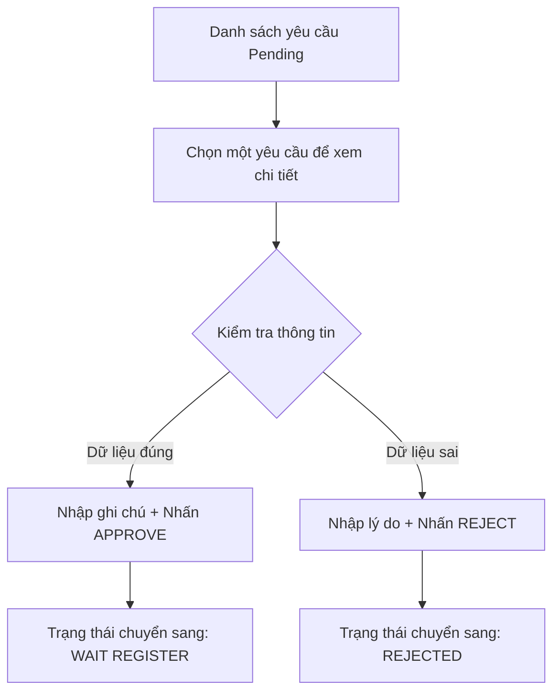

# Hướng dẫn Màn hình Phê duyệt (Double Check)

## 1. Tổng quan
Màn hình **Double Check** dành cho cấp quản lý hoặc kỹ thuật viên cao cấp để kiểm soát chất lượng dữ liệu đăng ký. Đây là chốt chặn quan trọng để đảm bảo thông tin phần cứng được khai báo chính xác trước khi đưa vào vận hành.

**Chức năng chính:**
*   Xem danh sách các yêu cầu đang chờ phê duyệt.
*   Kiểm tra chi tiết tổ hợp phần cứng và các tài liệu đính kèm.
*   Ra quyết định: Phê duyệt (Approve) hoặc Từ chối (Reject).

---

## 2. Luồng hoạt động (Process)

---

## 3. Giao diện và Thao tác
1.  **Sidebar (Bên trái):** Danh sách các yêu cầu đang chờ xử lý, hiển thị rút gọn thông tin Device, Platform và Người gửi.
2.  **Panel Chi tiết (Bên phải):** 
    *   Hiển thị toàn bộ thông số kỹ thuật đã khai báo.
    *   Hiển thị bảng Mapping Hardware chi tiết.
    *   Danh mục file đính kèm: Nhấn vào để tải về và kiểm tra.
3.  **Action Bar (Dưới cùng):**
    *   **Review Notes:** Ô nhập ý kiến chỉ đạo hoặc lý do từ chối.
    *   **Approve/Reject Buttons:** Thực hiện cập nhật trạng thái vào hệ thống.

---

## 4. Đặc điểm nổi bật
*   **Real-time List:** Danh sách yêu cầu được cập nhật ngay sau khi người dùng thực hiện xong thao tác.
*   **Download File:** Hỗ trợ xem trực tiếp các bằng chứng đính kèm từ bước Master Registration.
*   **Security:** Chỉ những người dùng có quyền (được chỉ định là Approver) mới thấy và thực hiện được các thao tác trên màn hình này.

---

## 5. Lưu ý kỹ thuật
*   **Service**: `DoubleCheckService.js`.
*   **Stored Procedure**: `USP_ACH_ProcessDoubleCheck` xử lý việc cập nhật trạng thái vào bảng `ACH_TesterHardwareMaster`.

---
*Tài liệu được cập nhật lần cuối vào: 2024-05-20*
