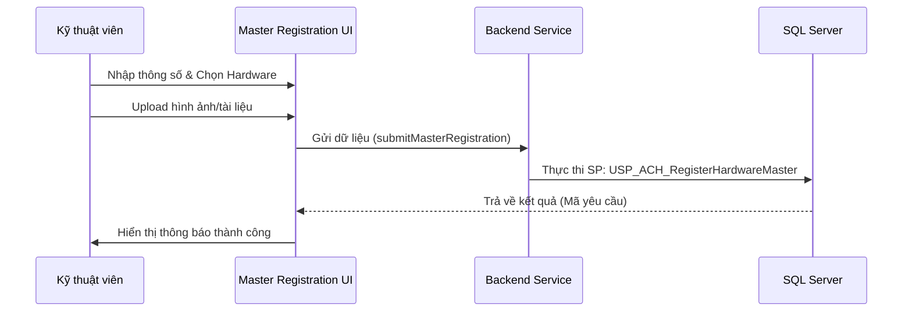

# Hướng dẫn Màn hình Đăng ký Master (Master Registration)

## 1. Tổng quan
Màn hình **Master Registration** là bước đầu tiên trong quy trình thiết lập hệ thống. Tại đây, kỹ thuật viên thực hiện khai báo các tổ hợp phần cứng (TB, CK, MP...) tương ứng với từng Model thiết bị và Tester cụ thể.

**Chức năng chính:**
*   Khai báo thông số kỹ thuật (Customer, Device, Package, Pitch, Recipe).
*   Thiết lập danh mục linh kiện phần cứng đi kèm.
*   Tải lên các tài liệu hướng dẫn hoặc hình ảnh kiểm chứng.
*   Gửi yêu cầu phê duyệt đến cấp quản lý (Double Check).

---

## 2. Luồng dữ liệu (Data Flow)

---

## 3. Các thành phần chính
1.  **New Registration (Tab 1):**
    *   **Technical Parameters:** Các thông tin định danh Model.
    *   **Hardware Configuration:** Danh sách các linh kiện vật lý (chọn loại linh kiện và mã linh kiện).
    *   **Attachments:** Cho phép đính kèm tối đa 5 file (PDF, hình ảnh, Excel).
    *   **Approver:** Chọn quản lý sẽ thực hiện bước Double Check.
2.  **My History (Tab 2):**
    *   Theo dõi trạng thái các yêu cầu đã gửi (Pending, Registered, Rejected, Returned).
    *   Xem lý do nếu yêu cầu bị từ chối.

---

## 4. Trạng thái yêu cầu (Workflow Status)
*   **PENDING**: Đang chờ Double Check.
*   **WAIT REGISTER**: Đã duyệt bước 1, chờ đăng ký vào Matrix.
*   **REGISTERED**: Đã hoàn tất quy trình, dữ liệu đã vào Ma trận sử dụng.
*   **REJECTED**: Bị từ chối (Kết thúc quy trình).
*   **RETURNED**: Bị trả lại để chỉnh sửa (Cần cập nhật và gửi lại).

---

## 5. Lưu ý kỹ thuật
*   **FileUpload**: Sử dụng `apiClient.uploadFile` để đẩy file lên server trước khi submit data.
*   **Validation**: Toàn bộ các trường đánh dấu `required` phải được điền đầy đủ trước khi nút Submit có hiệu lực.
*   **Service**: Sử dụng `MasterRegistrationService.js`.

---
*Tài liệu được cập nhật lần cuối vào: 2024-05-20*
