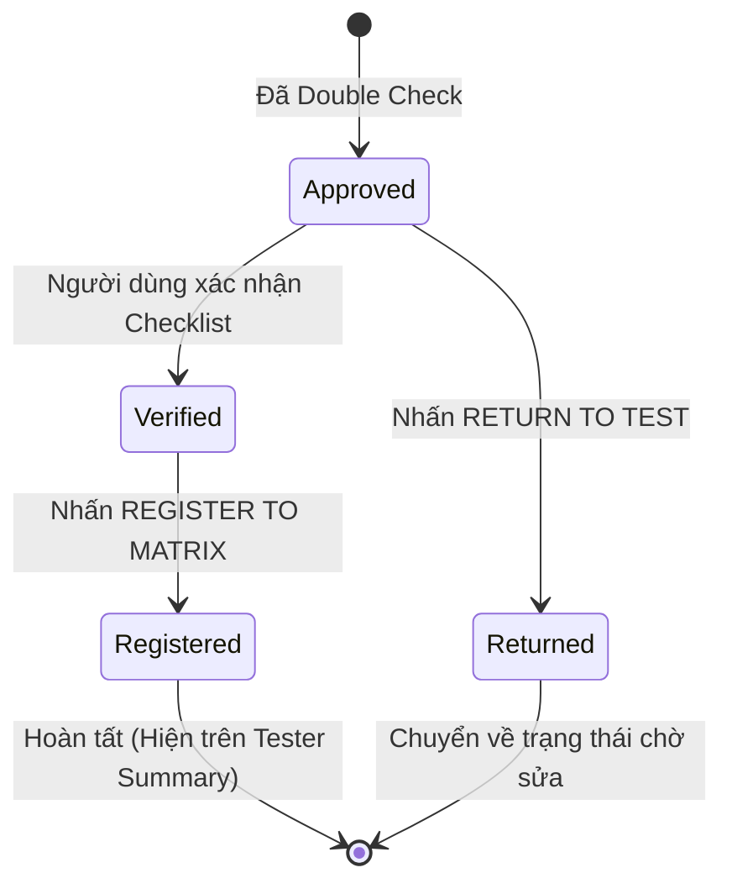

# Hướng dẫn Màn hình Đăng ký Ma trận (Matrix Registration)

## 1. Tổng quan
Màn hình **Matrix Registration** là bước cuối cùng trong quy trình Auto Control Hardware. Tại đây, các yêu cầu đã qua bước Double Check sẽ được chính thức "đóng dấu" (Register) để dữ liệu có hiệu lực trong bảng Ma trận vận hành thực tế.

**Chức năng chính:**
*   Quản lý các cấu hình đã được phê duyệt nhưng chưa có trong Matrix.
*   Xác nhận tính chính xác vật lý lần cuối (Checklist).
*   Đưa dữ liệu vào bảng `ACH_TesterHardwareMatrix` (Official Matrix).
*   Trả lại yêu cầu (Return to TEST) nếu phát hiện sai sót phút chót.

---

## 2. Luồng hoạt động (System Flow)

---

## 3. Các thành phần chính
1.  **Sidebar (Bên trái):** Danh sách các cấu hình `WAIT REGISTER`. Có tính năng tìm kiếm nhanh theo Device hoặc ID.
2.  **Panel Thông tin chi tiết:** Hiển thị toàn bộ dữ liệu tiêu chuẩn đã được duyệt.
3.  **Pre-Registration Checklist:** Một hộp thoại nhắc nhở quan trọng. Người dùng **bắt buộc** phải tích vào ô xác nhận ("I verify that...") thì nút Register mới được kích hoạt.
4.  **Hành động:**
    *   **Register to Matrix:** Chuyển trạng thái sang `REGISTERED`.
    *   **Return to Test:** Trả lời về phòng Kỹ thuật (TEST) để chỉnh sửa lại thông tin nếu có sai sót.

---

## 4. Tại sao cần bước này?
Mặc dù đã qua bước Double Check, nhưng đây là lúc xác nhận việc **khai báo dữ liệu vào hệ thống vận hành**. Việc này tách biệt giữa "Duyệt về mặt lý thuyết" (Double Check) và "Đưa vào áp dụng thực tế" (Matrix Register), giúp kiểm soát chặt chẽ các linh kiện quan trọng.

---

## 5. Lưu ý kỹ thuật
*   **Service**: `MatrixRegistrationService.js`.
*   **Stored Procedure**: 
    *   `USP_ACH_RegisterToMatrix`: Thực hiện đưa dữ liệu vào bảng Matrix chính thức.
    *   `USP_ACH_ReturnToTest`: Trả lời yêu cầu về bước khởi tạo.
*   **UI Component**: Sử dụng `PrimeVue ConfirmDialog` để xác nhận trước khi thực hiện các thao tác quan trọng.

---
*Tài liệu được cập nhật lần cuối vào: 2024-05-20*
