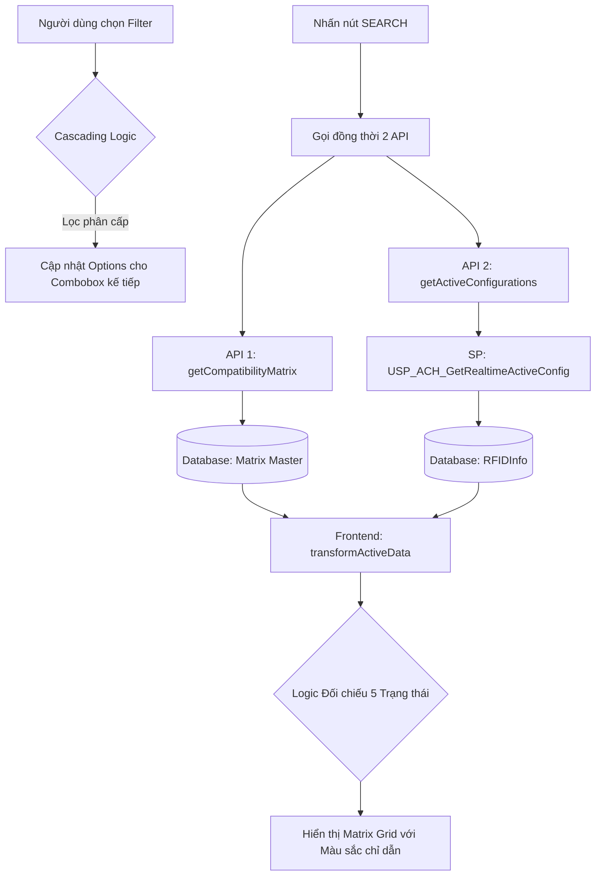

# Hướng dẫn Màn hình Giám sát Cấu hình Tester (Tester Summary)

## 1. Tổng quan
Màn hình **Tester Summary** là công cụ hỗ trợ bộ phận sản xuất (MFG) và kỹ thuật (PE) giám sát thực tế các bộ phần cứng (Hardware) đang được lắp trên máy Tester và đối chiếu với Ma trận tương thích (Compatibility Matrix) đã đăng ký.

**Mục tiêu chính:**
*   Giám sát Real-time linh kiện trên máy qua hệ thống RFID.
*   Phát hiện sớm các trường hợp lắp sai tổ hợp phần cứng (Illegal Setup).
*   Hỗ trợ PM/MFG tìm kiếm máy trống phù hợp để điều phối sản xuất (Ready to Setup).

---

## 2. Luồng hoạt động (System Flow)

---

## 3. Logic Bộ lọc (Cascading Filters)
Hệ thống sử dụng bộ lọc phân cấp một chiều để đảm bảo tính hợp lệ của dữ liệu:
*   **Customer > Device > Package > Tester ID**.
*   Khi thay đổi cấp cha (ví dụ: Customer), tất cả các cấp con (Device, Package...) sẽ tự động reset về rỗng.
*   Danh sách lựa chọn trong mỗi ô sẽ chỉ hiển thị các giá trị có tồn tại trong database dựa trên lựa chọn của ô phía trước.
*   **Style hiện đại**: Giao diện bộ lọc sử dụng `FloatLabel` và `MultiSelect` với bo góc mềm mại (`rounded-md`), đồng bộ với hệ thống.

---

## 4. Logic Màu sắc & Trạng thái (Visual Guide)
Đây là phần quan trọng nhất để người dùng nhận diện trạng thái máy qua khu vực **Current Active Configuration**:

| Màu sắc | Trạng thái | Hiển thị | Ý nghĩa | Hành động đề xuất |
| :--- | :--- | :--- | :--- | :--- |
| **Xanh Lá** | **Ready** | **READY** | Máy đang **Trống** và **Tương thích** với Package đang chọn. | Ưu tiên điều phối hàng vào đây. |
| **Xanh Dương** | **Matching** | Mã linh kiện | Máy đang lắp **Đúng** bộ linh kiện theo Ma trận mục tiêu. | Tiếp tục duy trì sản xuất. |
| **Vàng** | **Busy** | Mã linh kiện | Máy đang lắp bộ linh kiện hợp lệ nhưng cho **Package khác**. | Cần Change-over nếu muốn dùng. |
| **Đỏ** | **Illegal** | Mã linh kiện | **CẢNH BÁO:** Lắp sai linh kiện hoặc linh kiện chưa đăng ký. | Dừng máy, kiểm tra phần cứng. |
| **Trắng** | **Unsupported** | `---` | Máy hiện đang trống và **Không hỗ trợ** Package này. | Không điều phối hàng vào đây. |

---

## 5. Cấu trúc dữ liệu Grid
Bảng ma trận được chia làm 2 phần chính:
1.  **Current Active Configuration (RFID Real-time)**: 
    *   Hiển thị dữ liệu thực tế đang chạy trên máy.
    *   Sử dụng nhãn **READY** và màu sắc nổi bật để hỗ trợ PM tìm máy trống.
2.  **Registered Compatibility Matrix (Reference Matrix)**:
    *   Hiển thị dữ liệu tiêu chuẩn đăng ký trong Master để tham chiếu.
    *   Sử dụng hiệu ứng kẻ sọc (`incompatible-cell`) cho các ô không hỗ trợ để phân biệt với phần Real-time.
    *   Bao gồm cả thông tin phụ: Pitch (mm), Handler Recipe.

---

## 6. Lưu ý kỹ thuật cho Lập trình viên
*   **Service**: `TesterSummaryService.js` quản lý việc gọi API.
*   **Stored Procedure**: `USP_ACH_GetRealtimeActiveConfig` xử lý bóc tách chuỗi RFID (TB, CK, MP) từ hệ thống CIMitar.
*   **Frontend Logic**: 
    *   Trạng thái **Ready** được xác định khi `isHwEmpty` là true và `isCompatibleWithPackage` (kiểm tra cặp Tester-Package trong Matrix) là true.
    *   CSS sử dụng Tailwind kết hợp PrimeVue v4 styles.
*   **Legend**: Hiển thị trên một dòng duy nhất, hỗ trợ cuộn ngang trên màn hình nhỏ.

---
*Tài liệu được cập nhật lần cuối vào: 2026-04-14*
