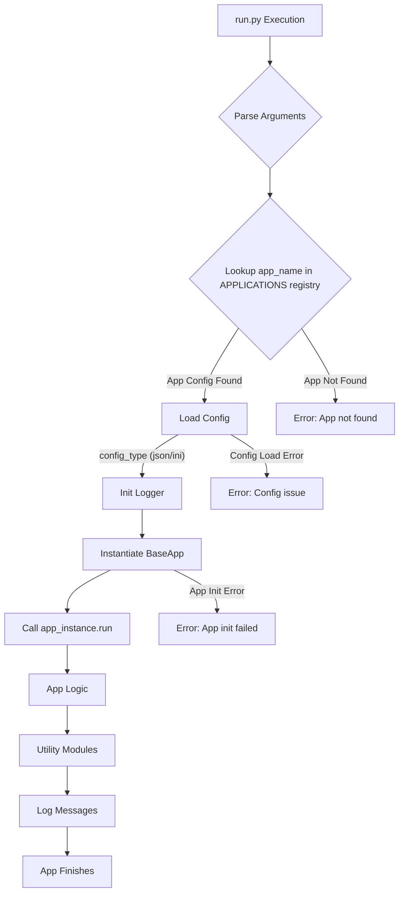

# Common Base Python Project

**Description**
This project serves as a robust and extensible common base for developing various Python services and background processes. It emphasizes modularity, flexible configuration management, and centralized logging, providing a solid foundation for rapid application development.

**Overview**
The core idea is to provide a standardized framework where individual applications (services or processes) can be easily integrated and managed. The project separates core functionalities (like configuration and logging) from application-specific logic, allowing for clean, maintainable, and scalable solutions. Applications are registered and launched via a central entry point, with their specific configurations handled dynamically.

---

## Table of Contents

* [Installation](#installation)
* [Usage](#usage)
* [Features](#features)
* [Configuration](#configuration)
* [Project Flow](#project-flow)
* [Project Structure](#project-structure)
* [Technologies](#technologies)
* [Development](#development)

  * [Testing](#testing)
  * [Contributing](#contributing)
  * [Issues](#issues)
* [Troubleshooting](#troubleshooting)

---

## Installation

### Prerequisites

*   **Python 3.x** (recommended Python 3.8+)

### Steps to Install

1.  **Clone the repository:**
    ```bash
    git clone <repository_url>
    cd Common_Base
    ```
2.  **Install dependencies:**
    It's highly recommended to use a virtual environment.
    ```bash
    python -m venv venv
    # On Windows:
    .\venv\Scripts\activate
    # On macOS/Linux:
    source venv/bin/activate

    pip install -r requirements.txt
    ```

---

## Usage

### How to Run a Single Application

The `run.py` script is designed to launch a single application registered in its `APPLICATIONS` dictionary. It accepts command-line arguments for the application name and configuration type.

```bash
python run.py <app_name> [--config_type <json|ini>]
```

*   `<app_name>`: The name of the application as defined in `run.py`'s `APPLICATIONS` dictionary (e.g., `CommonBaseApp`).
*   `--config_type`: (Optional) Specifies whether to load configuration from `config.json` (default) or `config.ini`. Default is `json`.

**Example:**

```bash
python run.py CommonBaseApp --config_type json
```

### Orchestrating Multiple Applications

For running multiple applications, either sequentially or in parallel, it is recommended to use shell scripts (`.bat`, `.sh`, `.ps1`). These scripts can call `run.py` multiple times with different arguments.

#### Using `run.bat` (Windows Batch Script)

**Sequential Execution:**

```batch
@echo off
REM Run applications one after another
python run.py CommonBaseApp --config_type json
python run.py AnotherApp --config_type ini
echo All applications finished.
```

**Parallel Execution:**

```batch
@echo off
REM Run applications concurrently
start /b python run.py CommonBaseApp --config_type json
start /b python run.py AnotherApp --config_type ini
REM Add a timeout or a more robust waiting mechanism if needed
REM For simple cases, the command prompt will wait for 'start'ed processes to finish
echo All parallel applications launched.
```

#### Using `run.sh` (Bash Script for Linux/macOS)

**Sequential Execution:**

```bash
#!/bin/bash
# Run applications one after another
python run.py CommonBaseApp --config_type json
python run.py AnotherApp --config_type ini
echo "All applications finished."
```

**Parallel Execution:**

```bash
#!/bin/bash
# Run applications concurrently
python run.py CommonBaseApp --config_type json &
python run.py AnotherApp --config_type ini &
wait # Waits for all background jobs to complete
echo "All parallel applications finished."
```

#### Using `run.ps1` (PowerShell Script)

**Sequential Execution:**

```powershell
# Run applications one after another
python run.py CommonBaseApp --config_type json
python run.py AnotherApp --config_type ini
Write-Host "All applications finished."
```

**Parallel Execution:**

```powershell
# Run applications concurrently using Start-Job
# Note: Output from Start-Job needs to be explicitly retrieved with Receive-Job
Start-Job -ScriptBlock { python run.py CommonBaseApp --config_type json }
Start-Job -ScriptBlock { python run.py AnotherApp --config_type ini }
Get-Job | Wait-Job | Receive-Job # Wait for jobs and get their output
Write-Host "All parallel applications finished."
```

---

## Features

*   **Modular Application Framework**: Easily integrate new services by extending `src/core/base_app.py` and registering them in `run.py`.
*   **Flexible Configuration Management**: Supports both `JSON` and `INI` configuration formats, allowing for nested structures and application-specific settings.
*   **Centralized & Dynamic Logging**: A robust logging setup (`src/core/logger.py`) with customizable log file paths using dynamic patterns (e.g., by date, hostname, or IP). It includes timestamps, log levels, filenames, and line numbers for enhanced debugging.
*   **API Client Utilities**: Includes synchronous (`enco_api_client.py`) and asynchronous (`enco_api_client_async.py`) clients for interacting with the EnCo API, featuring encryption and error logging.
*   **File & Folder Utilities**: A collection of helper functions (`src/utility/file_folder_utils/utils.py`) for common file system operations.
*   **SQLite Utilities**: Helper functions (`src/utility/sqlite_utils/sqlite_helpers.py`) for simplified SQLite database interactions.

---

## Configuration

Configuration is managed through files in the `config/` directory (`config.json` and `config.ini`). The `Config` class (`src/core/config.py`) loads these files, supporting a nested structure where settings are grouped by application and then by component (e.g., `CommonBaseApp.Logging`).

A significant feature is the ability to define a dynamic path for log files using the `LOG_PATTERN` setting.

### Log Pattern Placeholders

The `LOG_PATTERN` in your configuration supports several placeholders to create dynamic log file paths. Here are the available placeholders:

| Placeholder  | Description                                        | Example Value            |
|--------------|----------------------------------------------------|--------------------------|
| `{hostname}` | The hostname of the local machine.                 | `my-dev-machine`         |
| `{local-ip}` | The local IP address of the machine.               | `192.168.1.10`           |
| `{app}`      | The name of the application being run.             | `CommonBaseApp`          |
| `{date}`     | The current date (`YYYY-MM-DD`).                   | `2025-11-19`             |
| `{time}`     | The current time (`HH-MM-SS`).                     | `14-30-55`               |
| `{datetime}` | The current date and time (`YYYY-MM-DD_HH-MM-SS`). | `2025-11-19_14-30-55`    |
| `{year}`     | The current year (`YYYY`).                         | `2025`                   |
| `{month}`    | The current month (`MM`).                          | `11`                     |
| `{day}`      | The current day of the month (`DD`).               | `19`                     |
| `{hour}`     | The current hour (`HH`, 24-hour format).           | `14`                     |
| `{minute}`   | The current minute (`MM`).                         | `30`                     |
| `{second}`   | The current second (`SS`).                         | `55`                     |
| `{pid}`      | The process ID of the application.                 | `12345`                  |
| `{level}`    | The log level configured for the application.      | `INFO`                   |

### Example Configurations

**Example `config.json` structure:**

```json
{
    "CommonBaseApp": {
        "Logging": {
            "LOG_LEVEL": "INFO",
            "LOG_DIR": "logs",
            "LOG_PATTERN": "{hostname}_{local-ip}/{year}/{month}/{app}_{date}.log"
        },
        "API_Common": {
            "api_link_1": "http://10.201.12.30:8004",
            "api_link_2": "http://10.201.12.31:8004"
        }
    }
}
```

**Example `config.ini` structure:**

```ini
[CommonBaseApp.Logging]
log_level       = INFO
log_dir         = logs
log_pattern     = {hostname}_{local-ip}/{year}/{month}/{app}_{date}.log

[CommonBaseApp.API_Common]
api_link_1    = http://10.201.12.30:8004
api_link_2    = http://10.201.12.31:8004
```

---

## Project Flow

### Overview of the Project Flow

Here’s a **Mermaid diagram** illustrating the high-level flow when `run.py` is executed for a single application:



This diagram shows the basic flow:

1.  **`run.py` is executed** with an application name and optional configuration type.
2.  **Arguments are parsed**, and the `APPLICATIONS` registry is consulted to find the application's module and class.
3.  The **`Config` class** loads the appropriate configuration (`.json` or `.ini`) for the specified application.
4.  The **logger is initialized** using the application's logging configuration.
5.  The **application class is instantiated** (inheriting from `BaseApp`), receiving its configuration and logger.
6.  The application's **`run()` method is executed**, performing its specific logic, potentially utilizing utility modules and logging its progress.

---

## Project Structure

### Directory Structure

Here’s an **ASCII diagram** of the project structure:

```
.
├── .vscode/            # VS Code specific configurations
│   └── launch.json     # Debugging configurations
├── config/             # Configuration files (config.ini, config.json)
├── logs/               # Application log files
├── src/                # Source code for the project
│   ├── apps/           # Individual application modules
│   │   └── common_base_app.py
│   ├── core/           # Core framework components
│   │   ├── base_app.py # Base class for all applications
│   │   ├── config.py   # Configuration loading and parsing
│   │   └── logger.py   # Centralized logging setup
│   └── utility/        # Reusable utility modules
│       ├── enco_common_api_utils/ # EnCo API clients and crypto
│       ├── file_folder_utils/     # File and folder manipulation
│       └── sqlite_utils/          # SQLite database helpers
├── requirements.txt    # Python dependencies
├── run.bat             # Example Windows batch script for orchestration
├── run.ps1             # Example PowerShell script for orchestration
├── run.py              # Main entry point for launching single applications
├── run.sh              # Example Bash script for orchestration
└── README.md           # Project documentation
```

---

## Technologies

*   **Programming Language**: Python 3.x
*   **Core Libraries**:
    *   `requests`: For synchronous HTTP requests (used in `enco_api_client.py`).
    *   `httpx`: For asynchronous HTTP requests (used in `enco_api_client_async.py`).
    *   `cryptography`: For cryptographic operations (used in `enco_crypto.py`).
    *   `configparser`: For parsing INI-style configuration files.
    *   `sqlite3`: Python's built-in SQLite database interface.

---

## Development

### Testing

The project currently lacks comprehensive unit tests. It is highly recommended to implement unit tests for all core components (`src/core/`), utility modules (`src/utility/`), and individual application logic (`src/apps/`).

### Debugging with VS Code

1.  Open the project in VS Code.
2.  Go to the **Run and Debug** view (Ctrl+Shift+D).
3.  Select the desired configuration from the dropdown (e.g., `Python: Debug CommonBaseApp (JSON)`).
4.  Click the green play button or press F5 to start debugging.

### Contributing

1.  Fork the repository (if applicable).
2.  Clone your fork to your local machine.
3.  Create a new branch (`git checkout -b feature-name`).
4.  Implement your changes, ensuring adherence to project conventions.
5.  Commit your changes (`git commit -am 'Add feature'`).
6.  Push your changes (`git push origin feature-name`).
7.  Open a Pull Request for review.

### Issues

If you encounter any bugs, have suggestions for improvements, or find parts of the documentation unclear, please open an issue in the project's issue tracker.

---

## Troubleshooting

*   **Error: "Application '<app_name>' not found."**
    *   **Solution**: Ensure that `<app_name>` is correctly spelled and registered in the `APPLICATIONS` dictionary within `run.py`.
*   **Error: "Could not import module '<module_path>'. Details: No module named '<module_name>'"**
    *   **Solution**: This usually means a required Python package is not installed. Run `pip install -r requirements.txt` to install all dependencies. If the error persists, check the module path in `run.py` and verify the file exists.
*   **Error: "Class '<class_name>' not found in module '<module_path>'"**
    *   **Solution**: Verify that the `class` name in the `APPLICATIONS` dictionary in `run.py` exactly matches the class definition in the specified module file.
*   **Configuration Loading Issues**: If an application fails to start due to configuration errors, double-check the `config.json` or `config.ini` file for syntax errors or missing keys, especially within the application's specific section.