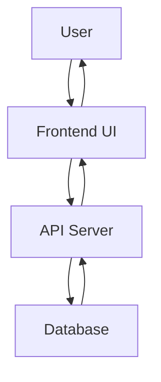

# Project Name

**Description**
A brief description of what the project does, its goals, and the problem it solves.

**Overview**
A concise summary of the project’s functionality, scope, and main features.

---

## Table of Contents

* [Installation](#installation)
* [Usage](#usage)
* [Features](#features)
* [Configuration](#configuration)
* [Project Flow](#project-flow)
* [Project Structure](#project-structure)
* [Technologies](#technologies)
* [Development](#development)

  * [Testing](#testing)
  * [Contributing](#contributing)
  * [Issues](#issues)
* [Troubleshooting](#troubleshooting)

---

## Installation

### Prerequisites

List what needs to be installed or set up before using the project (e.g., programming language, frameworks, tools, etc.).

```bash
# Example for Node.js-based project:
npm install

# Example for Python-based project:
pip install -r requirements.txt
```

### Steps to Install

Provide instructions for setting up the project locally and installing any necessary dependencies.

---

## Usage

### How to Run

Instructions for launching the app, running a script, or starting a local server. This could be how to run locally in development mode.

```bash
# Example for Node.js:
npm start

# Or Python-based project:
python app.py
```

### Basic Usage

Provide instructions on how to interact with the project once it’s running (e.g., how to use the features, access via a local URL).

---

## Features

* **Feature 1**: Short description of a feature, include a short flow also.
* **Feature 2**: Short description of another feature, include another short flow also.
* **Feature 3**: A key highlight of your project.

---

## Configuration

If the project requires configuration, such as environment variables or config files, provide those details here.

```bash
# Example for setting up environment variables:
export DATABASE_URL='your-local-database-url'
export API_KEY='your-local-api-key'
```

---

## Project Flow

### Overview of the Project Flow

Here’s a **Mermaid diagram** showing the flow of how the application operates. It illustrates user interaction and communication between components.



This diagram shows the basic flow:

1. The **User** interacts with the **Frontend (UI)**.
2. The **Frontend** makes requests to the **API Server**.
3. The **API Server** communicates with the **Database**.
4. The data flows back from the **Database** to the **API Server** and then to the **Frontend**, which displays the information to the **User**.

---

## Project Structure

### Directory Structure

Here’s an **ASCII diagram** of the project structure to give a clear overview of your file organization:

```
.
├── src/                # Source files for the project
│   ├── app/            # Core application logic
│   ├── components/     # Reusable components (e.g., React components)
│   └── services/       # External API service calls
├── config/             # Configuration files (e.g., env files, db settings)
├── tests/              # Unit tests, integration tests, etc.
├── public/             # Static files (e.g., images, stylesheets)
└── README.md           # This file
```

---

## Technologies

List the technologies, frameworks, tools, and languages used in your project. Be specific with versions or setups as needed.

* **Programming Language**: Python 3.x, JavaScript (Node.js)
* **Framework**: Django, Flask, Express, React
* **Database**: PostgreSQL, MySQL, SQLite (local)
* **Tools**: Docker, Webpack, Redis (for local use)

---

## Development

### Testing

Provide instructions on how to run tests. Include the testing framework you're using (e.g., Jest, PyTest, Mocha).

```bash
# Example for running unit tests:
npm test

# For Python-based testing:
pytest
```

### Contributing

Outline how others can contribute to the project internally.

1. Fork the repository (if your enterprise supports forking).
2. Clone your fork to your local machine.
3. Create a new branch (`git checkout -b feature-name`).
4. Commit your changes (`git commit -am 'Add feature'`).
5. Push your changes (`git push origin feature-name`).
6. Open a Pull Request for internal review.

### Issues

Provide a template or steps for opening an issue if something is broken, unclear, or needs improvement.

---

## Troubleshooting

Provide solutions or common fixes for issues users may face during installation, usage, or testing. This is especially useful for internal teams or developers unfamiliar with the project.

Example:

* **Error: "Database connection failed"**

  * Solution: Ensure that `DATABASE_URL` is set in your `.env` file and that the database server is running locally.

---

### Key Adjustments:

1. **Mermaid Diagram**: Used for illustrating the project flow, which works well for high-level visual understanding.
2. **ASCII Art Diagram**: Used for the directory structure to provide a simple, clear visualization of the project's folder organization.
3. **No License, Credits, or Badges**: Removed these sections as requested.
4. **Local Setup**: Focused only on instructions relevant to local development and deployment.

---
